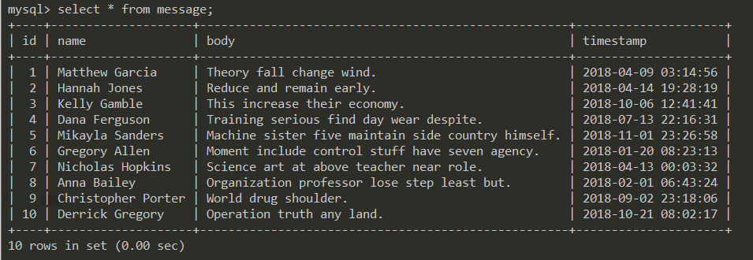

..  _19_faker_generate_fake_data.rst:

使用Faker生成虚拟数据
==========================

.. contents:: 目录

Faker简介
--------------------------

在软件需求、开发、测试过程中，有时候需要使用一些测试数据，针对这种情况，我们一般要么使用已有的系统数据，要么需要手动制造一些数据。在手动制造数据的过程中，可能需要花费大量精力和工作量，而使用faker生成虚拟数据可以为我们减少这部分的工作量。

安装
--------------------------

使用pip安装即可::
    
    pip install faker
    

引用与初始化
--------------------------

引用包::
    
    from faker import Faker

实例化::

    fake = Faker()     # use default locale en_US
    or:
    fake = Faker(locale='zh_CN') # 使用中文
    
Faker方法::

    >>> fake.
    fake.add_provider(                   fake.first_name_male(                fake.pydict(
    fake.address(                        fake.first_romanized_name(           fake.pyfloat(
    fake.am_pm(                          fake.format(                         fake.pyint(
    fake.ascii_company_email(            fake.free_email(                     fake.pyiterable(
    fake.ascii_email(                    fake.free_email_domain(              fake.pylist(
    fake.ascii_free_email(               fake.future_date(                    fake.pyset(
    fake.ascii_safe_email(               fake.future_datetime(                fake.pystr(
    fake.bank_country(                   fake.get_formatter(                  fake.pystruct(
    fake.bban(                           fake.get_providers(                  fake.pytuple(
    fake.binary(                         fake.hex_color(                      fake.random
    fake.boolean(                        fake.hexify(                         fake.random_choices(
    fake.bothify(                        fake.hostname(                       fake.random_digit(
    fake.bs(                             fake.iban(                           fake.random_digit_not_null(
    fake.building_number(                fake.image_url(                      fake.random_digit_not_null_or_empty(
    fake.catch_phrase(                   fake.internet_explorer(              fake.random_digit_or_empty(
    fake.century(                        fake.ipv4(                           fake.random_element(
    fake.chrome(                         fake.ipv4_network_class(             fake.random_elements(
    fake.city(                           fake.ipv4_private(                   fake.random_int(
    fake.city_name(                      fake.ipv4_public(                    fake.random_letter(
    fake.city_suffix(                    fake.ipv6(                           fake.random_letters(
    fake.color_name(                     fake.isbn10(                         fake.random_lowercase_letter(
    fake.company(                        fake.isbn13(                         fake.random_number(
    fake.company_email(                  fake.iso8601(                        fake.random_sample(
    fake.company_prefix(                 fake.job(                            fake.random_uppercase_letter(
    fake.company_suffix(                 fake.language_code(                  fake.randomize_nb_elements(
    fake.coordinate(                     fake.last_name(                      fake.rgb_color(
    fake.country(                        fake.last_name_female(               fake.rgb_css_color(
    fake.country_code(                   fake.last_name_male(                 fake.romanized_name(
    fake.credit_card_expire(             fake.last_romanized_name(            fake.safari(
    fake.credit_card_full(               fake.latitude(                       fake.safe_color_name(
    fake.credit_card_number(             fake.latlng(                         fake.safe_email(
    fake.credit_card_provider(           fake.lexify(                         fake.safe_hex_color(
    fake.credit_card_security_code(      fake.license_plate(                  fake.seed(
    fake.cryptocurrency(                 fake.linux_platform_token(           fake.seed_instance(
    fake.cryptocurrency_code(            fake.linux_processor(                fake.sentence(
    fake.cryptocurrency_name(            fake.local_latlng(                   fake.sentences(
    fake.currency(                       fake.locale(                         fake.set_formatter(
    fake.currency_code(                  fake.location_on_land(               fake.sha1(
    fake.currency_name(                  fake.longitude(                      fake.sha256(
    fake.date(                           fake.mac_address(                    fake.simple_profile(
    fake.date_between(                   fake.mac_platform_token(             fake.slug(
    fake.date_between_dates(             fake.mac_processor(                  fake.ssn(
    fake.date_object(                    fake.md5(                            fake.street_address(
    fake.date_of_birth(                  fake.mime_type(                      fake.street_name(
    fake.date_this_century(              fake.month(                          fake.street_suffix(
    fake.date_this_decade(               fake.month_name(                     fake.suffix(
    fake.date_this_month(                fake.msisdn(                         fake.suffix_female(
    fake.date_this_year(                 fake.name(                           fake.suffix_male(
    fake.date_time(                      fake.name_female(                    fake.text(
    fake.date_time_ad(                   fake.name_male(                      fake.time(
    fake.date_time_between(              fake.null_boolean(                   fake.time_delta(
    fake.date_time_between_dates(        fake.numerify(                       fake.time_object(
    fake.date_time_this_century(         fake.opera(                          fake.time_series(
    fake.date_time_this_decade(          fake.paragraph(                      fake.timezone(
    fake.date_time_this_month(           fake.paragraphs(                     fake.tld(
    fake.date_time_this_year(            fake.parse(                          fake.unix_device(
    fake.day_of_month(                   fake.password(                       fake.unix_partition(
    fake.day_of_week(                    fake.past_date(                      fake.unix_time(
    fake.district(                       fake.past_datetime(                  fake.uri(
    fake.domain_name(                    fake.phone_number(                   fake.uri_extension(
    fake.domain_word(                    fake.phonenumber_prefix(             fake.uri_page(
    fake.ean(                            fake.postcode(                       fake.uri_path(
    fake.ean13(                          fake.prefix(                         fake.url(
    fake.ean8(                           fake.prefix_female(                  fake.user_agent(
    fake.email(                          fake.prefix_male(                    fake.user_name(
    fake.file_extension(                 fake.profile(                        fake.uuid4(
    fake.file_name(                      fake.provider(                       fake.windows_platform_token(
    fake.file_path(                      fake.providers                       fake.word(
    fake.firefox(                        fake.province(                       fake.words(
    fake.first_name(                     fake.pybool(                         fake.year(
    fake.first_name_female(              fake.pydecimal(

常用方法
--------------------------

以下列出一些常用方法::

    >>> fake.name()         # 生成姓名
    '田鑫'
    >>> fake.address()      # 生成地址
    '山东省阳市高坪吕路A座 998657'

    >>> fake.country()      # 国家
    '意大利'
    >>> fake.province()     # 省份
    '安徽省'
    >>> fake.city()         # 城市
    '哈尔滨市'
    >>> fake.district()     # 区
    '徐汇'
    >>> fake.street_address()   # 街道
    '海门路I座'

    >>> fake.random_int()  # 随机数字，默认0~9999
    2257
    >>> fake.random_digit()  # 0~9随机数
    6
    >>> fake.random_number()  # 随机数字，参数digits设置生成的数字位数，返回random.randint(0, pow(10, digits) - 1)
    3229
    >>> fake.random_letter()  # 随机字母
    'Q'
    >>> fake.random_lowercase_letter()  # 随机小写字母
    'z'
    >>> fake.random_uppercase_letter()  # 随机大写字母
    'V'

    >>> fake.color_name()  # 颜色名
    'GoldenRod'
    >>> fake.color_name()
    'Chartreuse'
    >>> fake.color_name()
    'DeepPink'
    >>> fake.color_name()
    'MediumSpringGreen'

    >>> fake.company()  # 随机公司名
    '联通时科网络有限公司'

    >>> fake.bs()  # 随机公司服务名
    'mesh bleeding-edge infrastructures'
    >>> fake.company_suffix()  # 随机公司性质
    '信息有限公司'

    >>> fake.credit_card_number()  # 信用卡号
    '4803099375057291529'
    >>> fake.credit_card_provider()  # 信用卡类型
    'VISA 19 digit'

    >>> fake.currency_code()  # 货币代码
    'EUR'
    >>> fake.am_pm()  # AM/PM
    'AM'
    >>> fake.date()  # 日期
    '1974-08-12'
    >>> fake.date_this_year()  # 今年的随机日期
    datetime.date(2018, 5, 6)
    >>> fake.date_this_month()  # 这个月的随机日期
    datetime.date(2018, 11, 17)
    >>> fake.month()  # 随机月份数字
    '09'
    >>> fake.month_name()  # 随机月份名称
    'July'

    >>> fake.date_time_this_year()  # 今年的某个时间
    datetime.datetime(2018, 7, 21, 7, 43, 58)
    >>> fake.date_time()  # 随机时间
    datetime.datetime(2007, 9, 13, 14, 15, 54)
    >>> fake.time()  # 随机24小时时间，time对象
    '23:28:47'

    >>> fake.file_name()  # 文件名
    '更新.html'
    >>> fake.file_path()  # 文件路径
    '/的话/系列.docx'
    >>> fake.file_extension()  # 文件扩展
    'xlsx'

    >>> fake.mime_type()  # 随机mime类型
    'video/ogg'

    >>> fake.ascii_company_email()  # 随机公司邮箱
    'guiying74@xiajun.net'
    >>> fake.ascii_email()  # 随机邮箱
    'tangyan@gmail.com'

    >>> fake.ipv4()  # 随机IP4地址
    '126.162.176.179'
    >>> fake.ipv6()  # 随机IP6地址
    '9be4:c8c9:f589:f14b:24e6:2425:88c:bef9'

    >>> fake.mac_address()  # 随机MAC地址
    '7e:51:97:aa:8b:a1'
    >>> fake.url()  # 随机URI地址
    'http://luo.cn/'

    >>> fake.job()  # 随机职位
    '网络工程师'

    >>> fake.paragraph()  # 段落
    '准备帮助标题论坛.朋友开始类型网上这种.日本其他然后城市.'
    >>> fake.sentence()  # 随机一句话
    '产品应用操作详细.'
    >>> fake.word()  # 单词
    '参加'
    >>> fake.boolean()  # 随机布尔值
    False
    >>> fake.phone_number()  # 随机手机号
    '18071087230'
    >>> fake.profile()  # 随机档案
    {'job': '银行柜员', 'company': '四通科技有限公司', 'ssn': '220200194905157548', 'residence': '山西省长沙市城东童街R座 486365', 'current_location': (Decimal('61.941104'), Decimal('-177.651444')), 'blood_group': 'A+', 'website': ['https://gong.cn/', 'https://www.xiuyingna.org/', 'http://xp.cn/', 'http://www.wei.org/'], 'username': 'wei07', 'name': '廉雪梅', 'sex': 'F', 'address': '山西省金凤市上街公路M座 409920', 'mail': 'taotian@gmail.com', 'birthdate': datetime.date(1911, 12, 12)}

    >>> fake.ssn()  # 身份证号
    '510726199311249157'
    >>> fake.firefox()  # 随机生成FireFox的浏览器user_agent信息
    'Mozilla/5.0 (X11; Linux x86_64; rv:1.9.6.20) Gecko/2013-12-19 08:38:18 Firefox/13.0'
    >>> fake.user_agent()  # 随机user_agent信息
    'Mozilla/5.0 (iPod; U; CPU iPhone OS 4_1 like Mac OS X; ca-AD) AppleWebKit/531.14.4 (KHTML, like Gecko) Version/3.0.5 Mobile/8B113 Safari/6531.14.4'

随机密码
--------------------------
生成随机密码::

    >>> fake.password() # 随机密码
    's_3XwfSitx'

原代码::

    def password(
            self,
            length=10,
            special_chars=True,
            digits=True,
            upper_case=True,
            lower_case=True):
        """
        Generates a random password.
        @param length: Integer. Length of a password
        @param special_chars: Boolean. Whether to use special characters !@#$%^&*()_+
        @param digits: Boolean. Whether to use digits
        @param upper_case: Boolean. Whether to use upper letters
        @param lower_case: Boolean. Whether to use lower letters
        @return: String. Random password
        """

- 生成随机密码时，密码生成长度为10位，可以使用特殊字符、数字、大写字母、小写字母的密码。

使用Faker生成虚拟数据库数据
-----------------------------

如参考 `SayHello <http://github.com/greyli/sayhello.git>`_ 项目中构建flask命令行工具，生成虚拟数据库数据的例子，代码如下::

    #!/usr/bin/python3
    """
    @Author  : Zhaohui Mei(梅朝辉)
    @Email   : mzh.whut@gmail.com

    @Time    : 2018/11/17 9:01
    @File    : commands.py
    @Version : 1.0
    @Interpreter: Python3.6.2
    @Software: PyCharm

    @Description: 自定义Flask命令
    """

    """
        使用说明：
        在cmder命令行切换到commands.py所在的目录，然后设置FLASK_APP=commands
        $ set FLASK_APP=commands
        $ flask init   初始化
        $ flask forge --count=50 生成50个虚拟数据
    """

    import click

    from sayhello import app, db
    from sayhello.models import Message

    @app.cli.command()
    def initdb():
        # 新建数据表
        db.create_all()
        click.echo('Initialized database.')

    @app.cli.command()
    @click.option('--count', default=20, help='Quantity of messages,default is 20.')
    def forge(count):
        """Generate fake messages"""
        from faker import Faker

        db.drop_all()
        db.create_all()

        fake = Faker()  # 创建用来生成虚拟数据的Faker实例
        click.echo('Working...')

        for i in range(count):
            message = Message(
                name=fake.name(),
                body=fake.sentence(),
                timestamp=fake.date_time_this_year()
            )
            db.session.add(message)

        db.session.commit()

        click.echo(f'Created {count} fake messages!')

使用flask命令行创建虚拟数据::

    $ flask forge --count=10
    Working...
    Created 10 fake messages!

查询MYSQL数据库的数据如下图:

如果初始化fake时指定locale，如::

    fake = Faker(locale='zh_CN')

则显示如下:

.. image:: ./_static/images/use_faker_2.png

**注: 不同语种的可用方法可能不同，在使用过程中请参考官网说明。**

这样可以快速的添加多条虚拟数据，提高开发效率。

Faker地址： https://github.com/joke2k/faker

SayHello项目地址： http://github.com/greyli/sayhello

