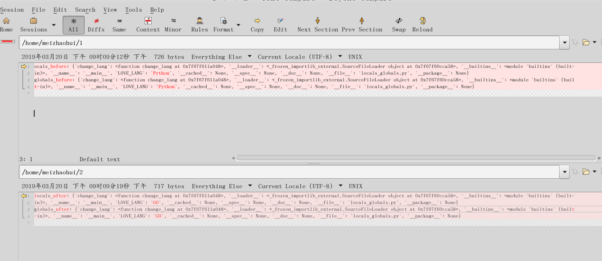

.. _function:

函数
======================

.. contents:: 目录

本节全面介绍python中函数的使用。

函数的创建
------------------

- 函数是重用的程序段。允许给一个语块一个名称，然后在别的位置调用这个函数。
- 代码复用的第一步是使用函数，它是命名的用于区分的代码段。
- 函数通过def关键字定义。
- 函数命名必须使用下划线_或字母开头，仅能有字母，数字和下划线,建议使用小写字母和下划线构建函数名。
- 如果函数不显示调用return函数，那么默认会返回None。

语法如下::

    def function_name([arg1,][arg2,][arg3]):
        cmds
        
    function_name 为函数名
    arg1/arg2/arg3 为形参

    
在PyCharm中运行::

    # 函数定义
    def sayhi(name):
        print('hi! ',name,'. I am Python. How are you?')
        
    # 调用函数，并传递参数'meizhaohui'
    sayhi('meizhaohui')

    # 运行结果如下::
    # hi!  meizhaohui . I am Python. How are you?
    
局部变量与全局变量
--------------------------

- 局部变量

当你在函数内定义变量时，它们与函数外具有相同名称的其他变量没有任何关系，即变量名称对于函数来说是局部的，这称为变量的作用域。

所有变量的作用域是它们被定义的块，从它们的名称被定义的那点开始。

- 全局变量

如果在函数中需要使用全局变量，也就是说这个变量能在函数外可以引用，需要使用global关键字进行定义，函数中的全局变量有以下限制::

    * 定义方式为global后面接全局变量名称VAR_NAME（即 global VAR_NAME   # 定义方式为global后面接全局变量名称VAR_NAME）
    * 全局变量定义时不能在后面赋值
    * 全局变量不能做为函数的传递参数，即一个变量不能即做参数也做全局变量
    * 建议使用大写字母和下划线构建全局变量名。
    
    

**如下所示的定义是正确的**::

    def saylang(lang):
        global LOVE_LANG  # 定义全局变量LOVE_LANG
        
**如下所示的定义是错误的**::

    def saylang(lang):
        global LOVE_LANG='python'
    
**如下所示的定义也是错误的**::

    def saylang(LOVE_LANG):
        global LOVE_LANG

**下面是一个全局变量的示例**::

    def saylang(lang):
        global LOVE_LANG
        LOVE_LANG = "Python"
        print('I think you will more love to learn',LOVE_LANG)
    LOVE_LANG = 'Java'
    print('Before running the function,you love to learn',LOVE_LANG)
    saylang(LOVE_LANG)
    print('After running the function,you love to learn',LOVE_LANG)

    # PyCharm中运行结果如下:
    # Before running the function,you love to learn Java
    # I think you will more love to learn Python
    # After running the function,you love to learn Python

**再看另外一个例子**::

    def earnmoney():
        global MONEY
        MONEY = MONEY + 2000
        print('You did good job. You earned more money! now you have $%s' % MONEY)
    MONEY = 2000
    print('You have $%s' % MONEY,'at first.',end='\n\n')
    # print('You have ${} at first.\n'.format(MONEY))
    earnmoney()
    earnmoney()
    earnmoney()

    # PyCharm中运行结果如下：
    # You have $2000 at first.

    # You did good job. You earned more money! now you have $4000
    # You did good job. You earned more money! now you have $6000
    # You did good job. You earned more money! now you have $8000

    # 调用了三次earnmoney()，每次都会增加$2000，最后就变成$8000了。
    

位置参数
-----------------------

- 位置参数是指调用函数时根据函数定义的参数位置来传递参数，此时调用函数时，参数个数必须与函数定义的个数相同，否则会报错。
- 位置参数的一个弊端是必须记住每个位置的参数的含义。

参见如下示例::

    def print_love_lang(name,lang):
        print('Hi,{},You love the language {}'.format(name,lang))

    print_love_lang('mei','Python')
    print_love_lang('mei')

    # PyCharm中运行结果如下：
    # Traceback (most recent call last):
    # Hi,mei,You love the language Python
    #   File "D:/data/python_scripts/test.py", line 5, in <module>
    #     printLoveLang('mei')
    # TypeError: print_love_lang() missing 1 required positional argument: 'lang'
    # 
    # 进程已结束,退出代码1
    
    
**注：示例中函数print_love_lang定义了两个参数name和lang，下面调用时print_love_lang('mei','Python')指定了两个参数，'mei'传递给参数name，'Python'传递给参数lang，可以正常打印出结果。而print_love_lang('mei')却只传递了一个参数，提示缺少一个位置参数'lang'。**

关键字参数
-----------------------

- 如果函数中有许多形式参数时，而仅想指定其中一部分时，可以通过命名来为这些参数赋值，这被称为关键字参数，即使用名字(关键字)来给函数指定实参。
- 这样做有以下优点：不用担心参数的顺序；假设其他参数都有默认值，我们只用给我们关心的参数赋值。
- 函数调用时，位置参数必须在关键参数前面定义，否则会报“positional argument follows keyword argument”错误。

参见如下示例::

    def print_love_lang(name,lang,year=3):
        print('Hi,',name,'. You love the language',lang,'. You have learnt it',year,'years!')

    print_love_lang('mei','Python',2)                 # 按位置参数进行依次传值
    print_love_lang('mei','Python')                   # 按位置参数进行依次传值，未传值给year,year取默认值3
    print_love_lang(name='mei',lang='Python',year=4)  # 按关键参数进行依次传值
    print_love_lang('mei','Python',year=5)            # 按位置参数+关键参数的形式进行依次传值，位置参数必须在关键参数前面
    print_love_lang('mei',lang='Python',year=6)       # 按位置参数+关键参数的形式进行依次传值，位置参数必须在关键参数前面
    # print_love_lang(name='mei','Python',year=7)     # 此种方式是错误的，会报“positional argument follows keyword argument”错误
    print_love_lang(year=7,name='mei',lang='Python')  # 按关键参数进行依次传值,不需要按照位置参数的顺序给关键字参数传值

    # 在PyCharm中运行结果：
    # Hi, mei . You love the language Python . You have learnt it 2 years!
    # Hi, mei . You love the language Python . You have learnt it 3 years!
    # Hi, mei . You love the language Python . You have learnt it 4 years!
    # Hi, mei . You love the language Python . You have learnt it 5 years!
    # Hi, mei . You love the language Python . You have learnt it 6 years!
    # Hi, mei . You love the language Python . You have learnt it 7 years!

    # print_love_lang(name='mei','Python',year=7)       # 此种方式是错误的，位置参数必须定义在关键参数前面
    # 错误信息如下:
    #     print_love_lang(name='mei','Python',year=7)       # 此种方式是错误的，位置参数必须定义在关键参数前面。
    #                             ^
    # SyntaxError: positional argument follows keyword argument
    # 
    # 进程已结束,退出代码1

默认参数值
-----------------------

- 对于某些函数，如果不想为参数提供值的时候，函数可以自动以默认值作为参数的值。
- 声明参数时，默认参数必须放置在位置参数列表的后面，不能先声明有默认值的参数(可以理解为关键字参数)，再声明无默认值的参数(可以理解为位置参数)。
- 必须先声明无默认值的参数，再声明有默认值的参数。
- 默认参数值在函数定义时已经计算出来，而不是在程序运行时。Python程序员经常犯的一个错误是把可变的数据类型(如列表或字典)当作默认的参数值。

默认值的定义方式为parameter=default_value，参见如下示例::

    # 定义print_message函数
    def print_message(message,times=10):
        print(message * times)

    print('打印20个*')
    print_message('*',20)   	# 此处给print_message()函数正常传递两个参数
    print('打印10个#')
    print_message('#')		# 此处给print_message()函数仅传递了一个参数，此时函数会将取times的默认值10，进行计算。

    # 在PyCharm中运行结果：
    # D:\ProgramFiles\Python3.6.2\python.exe D:/data/python_project/python_basic/basic_learning.py
    # 打印20个*
    # ********************
    # 打印10个#
    # ##########
    
下面示例给出了一个将可变数据类型当作默认值使用,存在的问题是：只有在第1次调用时列表是空的，第二次调用时就会存在之前调用的返回值::

    In [1]: def testerr(arg,result=[]): 
        ...:     result.append(arg) 
        ...:     print(result) 
        ...:                                                                        

    In [2]: testerr('a')                                                           
    ['a']

    In [3]: testerr('b')                                                           
    ['a', 'b']

    In [4]: testerr('c')                                                           
    ['a', 'b', 'c']

正确的做法如下::

    In [1]: def testerr(arg,result=None): 
        ...:     result=[]
        ...:     result.append(arg) 
        ...:     print(result) 
        ...:                                                                        

    In [2]: testerr('a')                                                           
    ['a']

    In [3]: testerr('b')                                                           
    ['b']

    In [4]: testerr('c')                                                           
    ['c']

可变参数
--------------------------

- 可变参数也就是在函数中接收元组(tuple)和字典(dict)
- 普通函数中的用法：def function_name(\*args, \*\*kwargs):
- 类函数中的用法：def method_name(self, \*args, \*\*kwargs):
- 当参数的个数不确定时，可以使用*args或**kwargs来接收参数组成的元组或字典
- 使用*收集位置参数，使用**收集关键字参数
- 元组存储在args中，字典存储在kwargs中
- \*args是可变的positional arguments列表组成的元组
- \*\*kwargs是可变的keyword arguments列表组成的字典
- \*args必须位于\*\*kwargs之前，位置参数必须位于关键字参数前
- 参数顺序：位置参数、默认参数、\*args、\**\kwargs
- \*或\*\*后面的关键字名称随意，不必非要使用args或kwargs，如\*name,\*\*lang等都可以

参见如下示例::

    def print_love_lang(*args, **kwargs):
        print('args:', args, 'type(args):', type(args))
        for value in args:
            print("positional argument:", value)
        print('kwargs:', kwargs, 'type(kwargs):', type(kwargs))
        for key in kwargs:
            print("keyword argument:\t{}:{}".format(key, kwargs[key]))

    print_love_lang(1, 2, 3, name='mei', lang='Python')

    # 运行结果如下：
    # args: (1, 2, 3) type(args): < class 'tuple'>
    # positional argument: 1
    # positional argument: 2
    # positional argument: 3
    # kwargs: {'name': 'mei', 'lang': 'Python'} type(kwargs): < class 'dict'>
    # keyword argument: name:mei
    # keyword argument: lang:Python

解包裹(unpack)参数
--------------------------

- \*args和\*\*kwargs语法不仅可以在函数定义中使用，同样可以在函数调用的时候使用。
- 不同的是，如果说在函数定义的位置使用*args和**kwargs是一个将参数pack(包裹)的过程，
- 那么在函数调用的时候就是一个将参数unpack(解包裹)的过程了。
- 解包裹时，dict中定义的key值必须与函数中定义的参数值相同、且参数个数相同，key的顺序不必保持与函数定义时的一致。

下面使用一个例子来加深理解::

    def test_args(first, second, third, fourth, fifth):
        print('First argument: ', first)
        print('Second argument: ', second)
        print('Third argument: ', third)
        print('Fourth argument: ', fourth)
        print('Fifth argument: ', fifth)

    # Use *args
    args = [1, 2, 3, 4, 5]
    print('Use *args')
    test_args(*args)
    # results:
    # Use *args
    # First argument:  1
    # Second argument:  2
    # Third argument:  3
    # Fourth argument:  4
    # Fifth argument:  5

    # Use **kwargs
    kwargs = {
        'first': 1,
        'second': 2,
        'third': 3,
        'fourth': 4,
        'fifth': 5
    }
    print('Use **kwargs')
    test_args(**kwargs)
    # results:
    # Use **kwargs
    # First argument:  1
    # Second argument:  2
    # Third argument:  3
    # Fourth argument:  4
    # Fifth argument:  5

文档字符串DocStrings
-----------------------------

- 程序的可读性很重要，建议在函数体开始的部分附上函数定义说明的文档，这就是 *文档字符串*
- 文档字符串DocStrings使用三引号包裹起来
- 文档字符串DocStrings的惯例是一个多行字符串，有以下规范::

    首行以大写字母开头，句号结尾
    第二行空行
    从第三行开始是详细的描述

- 可以使用__doc__ 调用函数的文档字符串。

如下所示::

    def print_love_lang(name, lang, year=3):
        """
        打印你学习编辑语言的年限.

        :param name: define the name
        :param lang: define the program language
        :param year: define the time you have learned the language
        :return: None
        """
        print('Hi,', name, '. You love the language', lang, '. You have learn it', year, 'years!')

    print(print_love_lang.__doc__)

    # 在PyCharm中运行结果：
    # 
    # 打印你学习编辑语言的年限.

    # :param name: define the name
    # :param lang: define the program language
    # :param year: define the time you have learned the language
    # :return: None

return语句
---------------------------

- return语句用来从一个函数返回，即跳出函数。return语句也可以返回一个值。
- 没有返回值的return语句等价于 *return None* 。
- None是python中表示没有任何东西的特殊类型。
- 如果函数结尾未提供return语句，python会给函数结尾暗含一个return None语句。

参见如下示例::

    # 指定return返回值
    def print_love_lang(name, lang, year=3):
        print('Hi,', name, '. You love the language', lang, '. You have learn it', year, 'years!')
        return 'nice'

    result = print_love_lang('mei', 'Python', 2)                 # 按位置参数进行依次传值
    print("return is:{}".format(result))
    
    # 运行结果如下：
    # Hi, mei . You love the language Python . You have learn it 2 years!
    # return is:nice
    
    # 不指定return返回值
    def print_love_lang(name, lang, year=3):
        print('Hi,', name, '. You love the language', lang, '. You have learn it', year, 'years!')

    result = print_love_lang('mei', 'Python', 2)                 # 按位置参数进行依次传值
    print("return is:{}".format(result))
    
    # 运行结果如下：
    # Hi, mei . You love the language Python . You have learn it 2 years!
    # return is:None

Python中的None
---------------------------

如果函数没有定义return返回值，则默认返回None。

- None是Python中一个特殊的值，不表示任何数据。
- None作为布尔值时与False是一样的，但其与False有很多差别。
- 0值的整型/浮点型、空符符串('')、空列表([])、空元组(())、空字典({})、空集合(set())都等价于False，但不等于None。

详细看以下示例::

    >>> def is_none(thing):
    ...     if thing is None:
    ...        print("It's None")
    ...     elif thing:
    ...        print("It's True")
    ...     else:
    ...        print("It's False")
    ...
    >>> is_none(None)
    It's None
    >>> is_none(True)
    It's True
    >>> is_none(False)
    It's False
    >>> is_none(1)
    It's True
    >>> is_none(0)
    It's False
    >>> is_none(-1)
    It's True
    >>> is_none('')
    It's False
    >>> is_none('string')
    It's True
    >>> is_none([])
    It's False
    >>> is_none(['list'])
    It's True
    >>> is_none({})
    It's False
    >>> is_none({'key':'value'})
    It's True
    >>> is_none((),)
    It's False
    >>> type((),)
    <class 'tuple'>
    >>> is_none(('tuple'))
    It's True
    >>> empty_set=set()
    >>> type(empty_set)
    <class 'set'>
    >>> is_none(empty_set)
    It's False
    >>> is_none(set('One'))
    It's True

内部函数
---------------------------

在函数中可以定义另外一个函数。

- 当需要在函数内部多次执行复杂的任务时，内部函数是非常有用的，从而避免了循环和代码的堆叠重复。

示例:: 

    In [1]: def outer(a, b): 
       ...:     def inner(c, d): 
       ...:         return c + d 
       ...:     return inner(a, b) 
       ...:                                                                         

    In [2]: outer(4, 7)                                                             
    Out[2]: 11

函数闭包
---------------------------

- 内部函数可以看作是一个 *闭包* 。
- *闭包* 是一个可以由另一个函数动态生成的函数，并且可以改变和存储函数外创建的变量的值。

示例::

    In [1]: def outer2(num1, num2): 
       ...:     def inner2(): 
       ...:         return num1 + num2
       ...:     return inner2 
       ...:                                                                         

    In [2]: outer2(4, 7)                                                               
    Out[2]: <function __main__.outer2.<locals>.inner2()>

    In [3]: outer2(4, 7)()                                                             
    Out[3]: 11

    In [4]: a = outer2(2, 3)                                                           

    In [5]: b = outer2(4, 7)                                                           

    In [6]: a()                                                                     
    Out[6]: 5

    In [7]: b()                                                                     
    Out[7]: 11

    In [8]: a                                                                       
    Out[8]: <function __main__.outer2.<locals>.inner2()>

    In [9]: b                                                                       
    Out[9]: <function __main__.outer2.<locals>.inner2()>

    In [10]: type(a)                                                                
    Out[10]: function

    In [11]: type(b)                                                                
    Out[11]: function

- inner2()直接使用外部的变量a和b,而不是通过另外一个参数获取。
- outer2()返回值为inner2函数，而不是调用它。
- return inner2 返回的是inner2函数的复制。
- inner2是一个闭包，一个被动态创建的可以记录外部变量的函数。
- a和b是函数，也是闭包。调用它们时，就会计算外部参数num1与num2的和。
- inner2能访问outer2及其祖先函数的命名空间内的变量(如局部变量，函数参数)。

函数装饰器
---------------------------

Python中非常重要的函数装饰器，后面单独分章节讲解。

命名空间和作用域
---------------------------

- 一个名称在不同的使用情况下可能指代不同的事物。Python程序有各种各样的 *命名空间* ,它指的是在该程序段内一个特定的名称是独一无二的，它和其他同名的命名空间是无关的。
- 每一个函数定义自己的命名空间。
- 每个程序的主要部分定义了全局命名空间，在这个命名空间的变量是全局变量，全局变量推荐使用大写字母或下划线组成的字符作为变量名GLOBAL_VAR_NAME，比如：LOVE_LANG = 'Python'。
- 在函数内部定义的变量是局部变量，推荐使用小写字母或下划线组成的字符作为变量名local_var_name，比如：this_is_a_variable = 1。
- locals()函数返回局部命名空间内容的字典。
- globals()函数返回全局命名空间内容的字典。

示例::

    #Filename:locals_globals.py
    LOVE_LANG = 'Python'
    def change_lang():
        author = 'Guido van Rossum'
        print('locals_in_function:', locals())
        global LOVE_LANG
        LOVE_LANG = 'GO'
        print('globals_in_function:', globals())
    
    print('locals_before:', locals())
    print('globals_before:', globals())
    change_lang()
    print('locals_after:', locals())
    print('globals_after:', globals())
   
使用python3 locals_globals.py运行::

    [meizhaohui@localhost ~]$ python3 locals_globals.py 
    locals_before: {'change_lang': <function change_lang at 0x7f67f611a048>, '__loader__': <_frozen_importlib_external.SourceFileLoader object at 0x7f67f60cca58>, '__builtins__': <module 'builtins' (built-in)>, '__name__': '__main__', 'LOVE_LANG': 'Python', '__cached__': None, '__spec__': None, '__doc__': None, '__file__': 'locals_globals.py', '__package__': None}
    globals_before: {'change_lang': <function change_lang at 0x7f67f611a048>, '__loader__': <_frozen_importlib_external.SourceFileLoader object at 0x7f67f60cca58>, '__builtins__': <module 'builtins' (built-in)>, '__name__': '__main__', 'LOVE_LANG': 'Python', '__cached__': None, '__spec__': None, '__doc__': None, '__file__': 'locals_globals.py', '__package__': None}
    locals_in_function: {'author': 'Guido van Rossum'}
    globals_in_function: {'change_lang': <function change_lang at 0x7f67f611a048>, '__loader__': <_frozen_importlib_external.SourceFileLoader object at 0x7f67f60cca58>, '__builtins__': <module 'builtins' (built-in)>, '__name__': '__main__', 'LOVE_LANG': 'GO', '__cached__': None, '__spec__': None, '__doc__': None, '__file__': 'locals_globals.py', '__package__': None}
    locals_after: {'change_lang': <function change_lang at 0x7f67f611a048>, '__loader__': <_frozen_importlib_external.SourceFileLoader object at 0x7f67f60cca58>, '__builtins__': <module 'builtins' (built-in)>, '__name__': '__main__', 'LOVE_LANG': 'GO', '__cached__': None, '__spec__': None, '__doc__': None, '__file__': 'locals_globals.py', '__package__': None}
    globals_after: {'change_lang': <function change_lang at 0x7f67f611a048>, '__loader__': <_frozen_importlib_external.SourceFileLoader object at 0x7f67f60cca58>, '__builtins__': <module 'builtins' (built-in)>, '__name__': '__main__', 'LOVE_LANG': 'GO', '__cached__': None, '__spec__': None, '__doc__': None, '__file__': 'locals_globals.py', '__package__': None}

对比函数执行前后的差异：

- 发现仅LOVE_LANG变量仅不一样，在执行函数change_lang后，LOVE_LANG从Python变成了GO。
- 在执行函数change_lang前，locals和global获取的值是一样的。
- 在执行函数change_lang时，locals只能获取到函数中的变量 {'author': 'Guido van Rossum'}。
- 如果要在函数内修改全局变量值，需要先使用global LOVE_LANG 这样的方法定义全局变量。再进行赋值修改。

参考文献:

【1】python的位置参数、默认参数、关键字参数、可变参数区别 https://www.cnblogs.com/bingabcd/p/6671368.html
