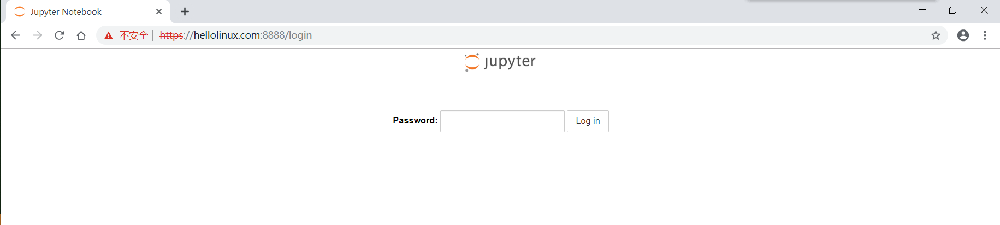
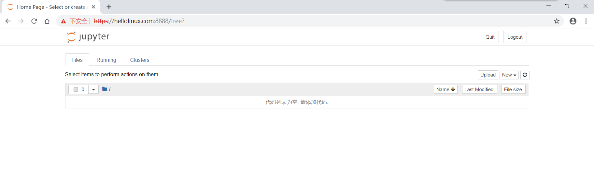
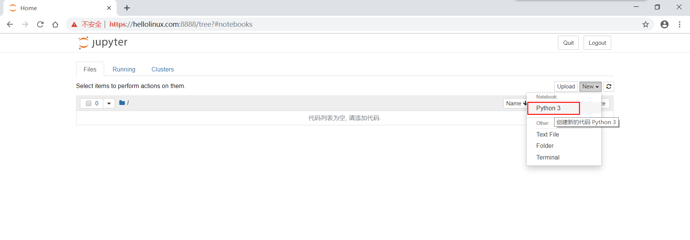
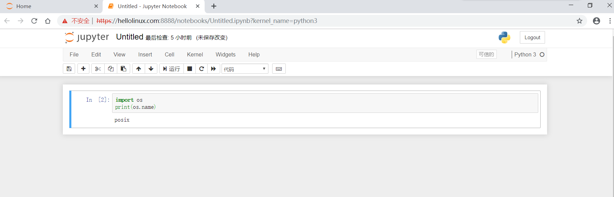
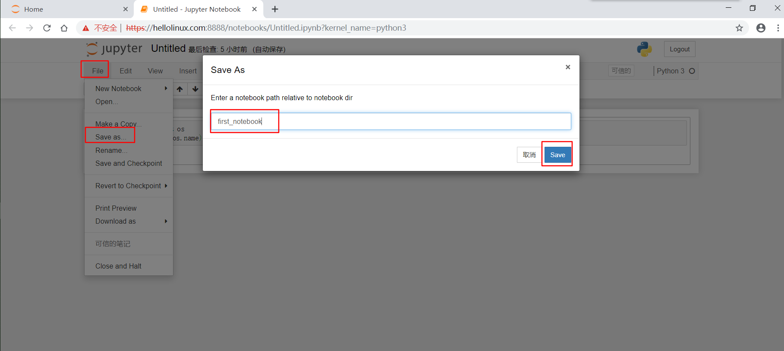

.. _install_python:

Python的安装
======================

.. contents:: 目录

本文讲解python3.6.2的安装。

Python下载地址
--------------------
Python3.6.2安装文件的下载地址如下：https://www.python.org/downloads/release/python-362/

CentOS上的安装方法
--------------------
- 下载安装文件::
    
    [root@localhost ~/download]# wget https://www.python.org/ftp/python/3.6.2/Python-3.6.2.tgz
- 解压::
    
    [root@localhost ~/download]# tar -zxvf Python-3.6.2.tgz
    
- 安装readline-devel解决方向键、Backspace键出现特殊符号::

    [root@localhost ~/download]# yum install readline-devel

- 检测你的安装平台的目标特征::

    [root@localhost ~/download]# cd Python-3.6.2
    [root@localhost ~/download/Python-3.6.2]# ./configure 

- 安装::

    [root@localhost ~/download/Python-3.6.2]# make
    
- 编译::

    [root@localhost ~/download/Python-3.6.2]# make install

    
- 查看python3的版本::

    [root@localhost ~/download/Python-3.6.2]# python -V
    Python 2.6.6
    [root@localhost ~/download/Python-3.6.2]# python3 -V
    Python 3.6.2

**CentOS系统中默认自带有Python程序，且版本是较低版本的Python 2.6.6，Python是Linux系统的基础软件，很多应用基于Python程序，不要随意改动系统的默认Python版本。**

- 启动::
    
    [root@localhost ~/download/Python-3.6.2]# python3
    Python 3.6.2 (default, Jun  8 2018, 22:28:47) 
    [GCC 4.4.7 20120313 (Red Hat 4.4.7-18)] on linux
    Type "help", "copyright", "credits" or "license" for more information.
    >>> 
        
为了更好的使用python程序，并且不影响系统的python2环境以及刚安装的python3环境，我们安装virtualenv创建隔绝的Python环境。

python虚拟环境virtualenv的安装
--------------------------------

- 安装::

    [root@localhost ~]# pip3 install virtualenv
    Collecting virtualenv
      Downloading https://files.pythonhosted.org/packages/b6/30/96a02b2287098b23b875bc8c2f58071c35d2efe84f747b64d523721dc2b5/virtualenv-16.0.0-py2.py3-none-any.whl (1.9MB)
        100% |████████████████████████████████| 1.9MB 5.9MB/s 
    Installing collected packages: virtualenv
    Successfully installed virtualenv-16.0.0
    
    [root@localhost ~]# virtualenv --version
    16.0.0
    
python虚拟环境virtualenv的使用
--------------------------------

- 创建virtual虚拟环境目录::

    [blogsystem@localhost ~]$ mkdir venv
    [blogsystem@localhost ~]$ ls
    blogs_home  download  venv

- 创建virtual虚拟运行环境::

    [blogsystem@localhost ~]$ virtualenv venv
    Using base prefix '/usr/local'
    New python executable in /cloud/blogsystem/venv/bin/python3.6
    Also creating executable in /cloud/blogsystem/venv/bin/python
    Installing setuptools, pip, wheel...done.

- 如果加上参数--no-site-packages，已经安装到系统Python环境中的所有第三方包都不会复制过来，会生成一个不带任何第三方包的“干净”的Python运行环境::

    [blogsystem@localhost ~]$ virtualenv --no-site-package env
    Using base prefix '/usr/local'
    New python executable in /cloud/blogsystem/env1/bin/python3.6
    Also creating executable in /cloud/blogsystem/env1/bin/python
    Installing setuptools, pip, wheel...done.
        
- 激活virtual虚拟运行环境venv::

    [blogsystem@localhost ~]$ source venv/bin/activate 
    (venv) [blogsystem@localhost ~]$ 
    
此时，命令行提示符发生了变化，有了 **(venv)** 前缀，表示当前处理名称为venv的python虚拟环境下。此时处于虚拟环境下，在该环境使用pip安装包，不会影响系统的Python环境，也不会影响他人的环境。

- 在虚拟环境venv下安装包::

    (venv) [blogsystem@localhost ~]$ pip list
    Package    Version
    ---------- -------
    pip        10.0.1 
    setuptools 39.2.0 
    wheel      0.31.1 
    
    (venv) [blogsystem@localhost ~]$ pip install pymysql
    Collecting pymysql
      Downloading https://files.pythonhosted.org/packages/32/e8/222d9e1c7821f935d6dba8d4c60b9985124149b35a9f93a84f0b98afc219/PyMySQL-0.8.1-py2.py3-none-any.whl (81kB)
        100% |████████████████████████████████| 81kB 63kB/s 
    Installing collected packages: pymysql
    Successfully installed pymysql-0.8.1
    
    (venv) [blogsystem@localhost ~]$ pip list
    Package    Version
    ---------- -------
    pip        10.0.1 
    PyMySQL    0.8.1  
    setuptools 39.2.0 
    wheel      0.31.1 

- 导出虚拟环境venv下的所有包到requirements.txt文件::

    (venv) [blogsystem@localhost ~]$ pip freeze > requirements.txt
    (venv) [blogsystem@localhost ~]$ ls
    blogs_home  download  requirements.txt  venv
    (venv) [blogsystem@localhost ~]$ cat requirements.txt 
    PyMySQL==0.8.1

- 在虚拟环境venv下卸载包::

    (venv) [blogsystem@localhost ~]$ pip uninstall pymysql
    Uninstalling PyMySQL-0.8.1:
      Would remove:
        /cloud/blogsystem/venv/lib/python3.6/site-packages/PyMySQL-0.8.1.dist-info/*
        /cloud/blogsystem/venv/lib/python3.6/site-packages/pymysql/*
    Proceed (y/n)? y
      Successfully uninstalled PyMySQL-0.8.1
    (venv) [blogsystem@localhost ~]$ pip list
    Package    Version
    ---------- -------
    pip        10.0.1 
    setuptools 39.2.0 
    wheel      0.31.1 

- 退出虚拟环境venv::

    (venv) [blogsystem@localhost ~]$ deactivate 
    [blogsystem@localhost ~]$ 
    
- 删除虚拟环境venv，直接删除venv文件夹即可::

    [blogsystem@localhost ~]$ ls
    blogs_home  download  requirements.txt  venv
    [blogsystem@localhost ~]$ rm -rf venv/
    [blogsystem@localhost ~]$ ls
    blogs_home  download  requirements.txt

- 通过requirements.txt在虚拟环境中安装包::

    [blogsystem@localhost ~]$ virtualenv venv
    Using base prefix '/usr/local'
    New python executable in /cloud/blogsystem/venv/bin/python3.6
    Also creating executable in /cloud/blogsystem/venv/bin/python
    Installing setuptools, pip, wheel...done.
    [blogsystem@localhost ~]$ source venv/bin/activate
    (venv) [blogsystem@localhost ~]$ pip list
    Package    Version
    ---------- -------
    pip        10.0.1 
    setuptools 39.2.0 
    wheel      0.31.1 
    (venv) [blogsystem@localhost ~]$ pip install -r requirements.txt 
    Collecting PyMySQL==0.8.1 (from -r requirements.txt (line 1))
      Using cached https://files.pythonhosted.org/packages/32/e8/222d9e1c7821f935d6dba8d4c60b9985124149b35a9f93a84f0b98afc219/PyMySQL-0.8.1-py2.py3-none-any.whl
    Installing collected packages: PyMySQL
    Successfully installed PyMySQL-0.8.1
    (venv) [blogsystem@localhost ~]$ pip list
    Package    Version
    ---------- -------
    pip        10.0.1 
    PyMySQL    0.8.1  
    setuptools 39.2.0 
    wheel      0.31.1 

以上安装并没有配置pip安装所使用的源，默认为官方的源，受网络影响，有时安装可能会比较慢，同时，使用vitrualenv运行虚拟环境时，必须需要到特定的目录下才能启动虚拟环境，使用有些不便，下面针对以上两个问题，分别配置pip国内源，以及安装virtualenvwrapper来管理虚拟环境。
    
pip国内镜像源配置
---------------------------

- linux环境配置方法

更改默认配置，~/.pip/pip.conf，一般这个文件需要自己创建::
    
    mkdir ~/.pip
    vim ~/.pip/pip.conf

在pip.conf文件中添加以下内容::

    [global]
    index-url = http://mirrors.aliyun.com/pypi/simple/
    [install]
    trusted-host = mirrors.aliyun.com

- windows环境配置方法

在当前用户下目录，新建一个pip文件夹和pip.ini文件，并在pip.ini中添加以下内容::

    [global]
    index-url = http://mirrors.aliyun.com/pypi/simple/
    [install]
    trusted-host = mirrors.aliyun.com

pip常用命令
---------------------------------------

- pip install package_name 安装包
- pip uninstall -y package_name 卸载包
- pip search package_name 查询包名
- pip list 列出安装了哪些包
- pip freeze > requirements.txt 生成依赖包列表
- pip install -r requirements.txt 安装依赖包

virtualenvwrapper的安装
---------------------------------------

- linux环境配置方法

使用pip进行安装,可以发现pip源已经替换成的阿里云源::

    [root@localhost ~]# pip install virtualenvwrapper
    Looking in indexes: http://mirrors.aliyun.com/pypi/simple/
    Collecting virtualenvwrapper
      Downloading http://mirrors.aliyun.com/pypi/packages/2b/8c/3192e10913ad945c0f0fcb17e9b2679434a28ad58ee31ce0104cba3b1154/virtualenvwrapper-4.8.2-py2.py3-none-any.whl
    Requirement already satisfied: stevedore in /usr/local/lib/python3.6/site-packages (from virtualenvwrapper) (1.28.0)
    Requirement already satisfied: virtualenv in /usr/local/lib/python3.6/site-packages (from virtualenvwrapper) (16.0.0)
    Requirement already satisfied: virtualenv-clone in /usr/local/lib/python3.6/site-packages (from virtualenvwrapper) (0.3.0)
    Requirement already satisfied: six>=1.10.0 in /usr/local/lib/python3.6/site-packages (from stevedore->virtualenvwrapper) (1.11.0)
    Requirement already satisfied: pbr!=2.1.0,>=2.0.0 in /usr/local/lib/python3.6/site-packages (from stevedore->virtualenvwrapper) (4.0.4)
    Installing collected packages: virtualenvwrapper
    Successfully installed virtualenvwrapper-4.8.2

创建虚拟目录::

    [root@localhost ~]# mkdir virtual_env

在~/.bashrc中末尾添加配置信息，并保存::

    export VIRTUALENVWRAPPER_PYTHON=/usr/bin/python3
    export WORKON_HOME=/root/virtual_env
    source /usr/local/bin/virtualenvwrapper.sh 

使配置信息的修改生效::

    [root@localhost ~]# source ~/.bashrc
    
- windows环境配置方法

使用pip进行安装,可以发现pip源已经替换成的阿里云源::

    E:\meichaohui\sphinx_data\meizhaohui_blog>pip install virtualenvwrapper-win
    Looking in indexes: http://mirrors.aliyun.com/pypi/simple/
    Collecting virtualenvwrapper-win
      Downloading http://mirrors.aliyun.com/pypi/packages/f5/23/4cba98733b9122219ce67177d745e4984b524b867cf3728eaa807ea21919/virtualenvwrapper-win-1.2.5.tar.gz
    Requirement already satisfied: virtualenv in d:\program files (x86)\python3.6.2\lib\site-packages (from virtualenvwrapper-win) (16.0.0)
    Installing collected packages: virtualenvwrapper-win
      Running setup.py install for virtualenvwrapper-win ... done
    Successfully installed virtualenvwrapper-win-1.2.5

创建虚拟目录::
    
    在D:\data目录下创建虚拟目录virtualenv_home。

配置环境变量::

    依次打开 控制面板\系统和安全\系统\高级系统设置\高级\环境变量，添加环境变量WORKON_HOME
    
    变量名：WORKON_HOME
    变量值：D:\data\virtualenv_home

virtualenvwrapper的使用
---------------------------------------

- linux环境virtualenvwrapper获取帮助::

    [root@localhost ~]# virtualenvwrapper

    virtualenvwrapper is a set of extensions to Ian Bicking's virtualenv
    tool.  The extensions include wrappers for creating and deleting
    virtual environments and otherwise managing your development workflow,
    making it easier to work on more than one project at a time without
    introducing conflicts in their dependencies.

    For more information please refer to the documentation:

        http://virtualenvwrapper.readthedocs.org/en/latest/command_ref.html

    Commands available:

      add2virtualenv: add directory to the import path

      allvirtualenv: run a command in all virtualenvs

      cdproject: change directory to the active project

      cdsitepackages: change to the site-packages directory

      cdvirtualenv: change to the $VIRTUAL_ENV directory

      cpvirtualenv: duplicate the named virtualenv to make a new one

      lssitepackages: list contents of the site-packages directory

      lsvirtualenv: list virtualenvs

      mkproject: create a new project directory and its associated virtualenv

      mktmpenv: create a temporary virtualenv

      mkvirtualenv: Create a new virtualenv in $WORKON_HOME

      rmvirtualenv: Remove a virtualenv

      setvirtualenvproject: associate a project directory with a virtualenv

      showvirtualenv: show details of a single virtualenv

      toggleglobalsitepackages: turn access to global site-packages on/off

      virtualenvwrapper: show this help message

      wipeenv: remove all packages installed in the current virtualenv

      workon: list or change working virtualenvs

- windows环境virtualenvwrapper获取帮助::

    D:\data> virtualenvwrapper

     virtualenvwrapper is a set of extensions to Ian Bicking's virtualenv
     tool.  The extensions include wrappers for creating and deleting
     virtual environments and otherwise managing your development workflow,
     making it easier to work on more than one project at a time without
     introducing conflicts in their dependencies.

     virtualenvwrapper-win is a port of Dough Hellman's virtualenvwrapper to Windows
     batch scripts.

     Commands available:

       add2virtualenv: add directory to the import path

       cdproject: change directory to the active project

       cdsitepackages: change to the site-packages directory

       cdvirtualenv: change to the $VIRTUAL_ENV directory

       lssitepackages: list contents of the site-packages directory

       lsvirtualenv: list virtualenvs

       mkproject: create a new project directory and its associated virtualenv

       mkvirtualenv: Create a new virtualenv in $WORKON_HOME

       rmvirtualenv: Remove a virtualenv

       setprojectdir: associate a project directory with a virtualenv
       toggleglobalsitepackages: turn access to global site-packages on/off

       virtualenvwrapper: show this help message

       whereis: return full path to executable on path.

       workon: list or change working virtualenvs

通过上面的帮助，可以知道linux系统和windows系统上面virtualenvwrapper大部分命令相同，下面在windows上面使用virtualenvwrapper。
    
- virtualenvwrapper常用命令::

     workon:列出虚拟环境列表
     lsvirtualenv:列出虚拟环境列表
     mkvirtualenv [virtualenv_name]:新建虚拟环境
     workon [virtualenv_name]:切换虚拟环境
     rmvirtualenv  [virtualenv_name]:删除虚拟环境
     deactivate: 离开虚拟环境

- 虚拟环境的使用示例::

    D:\data>workon

    Pass a name to activate one of the following virtualenvs:
    ==============================================================================
    venv

    D:\data>lsvirtualenv

    dir /b /ad "D:\data\virtualenv_home"
    ==============================================================================
    venv

    D:\data>mkvirtualenv venv_test
    Using base prefix 'd:\\program files (x86)\\python3.6.2'
    New python executable in D:\data\virtualenv_home\venv_test\Scripts\python.exe
    Installing setuptools, pip, wheel...done.

    (venv_test) D:\data>workon

    Pass a name to activate one of the following virtualenvs:
    ==============================================================================
    venv
    venv_test

    (venv_test) D:\data>lsvirtualenv

    dir /b /ad "D:\data\virtualenv_home"
    ==============================================================================
    venv
    venv_test

    (venv_test) D:\data>workon venv_test
    (venv_test) D:\data>pip install pymysql
    Looking in indexes: http://mirrors.aliyun.com/pypi/simple/
    Collecting pymysql
      Downloading http://mirrors.aliyun.com/pypi/packages/32/e8/222d9e1c7821f935d6dba8d4c60b9985124149b35a9f93a84f0b98afc219/PyMySQL-0.8.1-py2.py3-none-any.whl (81kB)
        100% |████████████████████████████████| 81kB 989kB/s
    Installing collected packages: pymysql
    Successfully installed pymysql-0.8.1

    (venv_test) D:\data>rmvirtualenv venv_test

        Deleted D:\data\virtualenv_home\venv_test
        
    (venv) D:\data>deactivate

    D:\data>

Linux环境安装和使用ipython和jupyter notebook
-------------------------------------------------

- ipython是一个python的交互式shell，比默认的python shell好用得多，支持变量自动补全，自动缩进，支持bash shell命令，内置了许多很有用的功能和函数。学习ipython将会让我们以一种更高的效率来使用python。同时它也是利用Python进行科学计算和交互可视化的一个最佳的平台。
    
安装ipython和jupyter::

    [root@hellolinux ~]# pip install ipython jupyter
    Looking in indexes: https://mirrors.aliyun.com/pypi/simple/
    Collecting ipython
      Downloading https://mirrors.aliyun.com/pypi/packages/f6/c4/a79582814bdfe92bfca4d286a729304ffdf13f5135132cfcaea13cf1b2b3/ipython-7.7.0-py3-none-any.whl (774kB)
         |████████████████████████████████| 778kB 381kB/s 
    Collecting jupyter
      Downloading https://mirrors.aliyun.com/pypi/packages/83/df/0f5dd132200728a86190397e1ea87cd76244e42d39ec5e88efd25b2abd7e/jupyter-1.0.0-py2.py3-none-any.whl
    Requirement already satisfied: jedi>=0.10 in /usr/lib/python3.6/site-packages (from ipython) (0.15.1)
    Requirement already satisfied: setuptools>=18.5 in /usr/lib/python3.6/site-packages (from ipython) (39.0.1)
    Requirement already satisfied: backcall in /usr/lib/python3.6/site-packages (from ipython) (0.1.0)
    Requirement already satisfied: traitlets>=4.2 in /usr/lib/python3.6/site-packages (from ipython) (4.3.2)
    Requirement already satisfied: prompt-toolkit<2.1.0,>=2.0.0 in /usr/lib/python3.6/site-packages (from ipython) (2.0.9)
    Requirement already satisfied: pexpect; sys_platform != "win32" in /usr/lib/python3.6/site-packages (from ipython) (4.7.0)
    Requirement already satisfied: decorator in /usr/lib/python3.6/site-packages (from ipython) (4.4.0)
    Requirement already satisfied: pickleshare in /usr/lib/python3.6/site-packages (from ipython) (0.7.5)
    Requirement already satisfied: pygments in /usr/lib64/python3.6/site-packages (from ipython) (2.4.2)
    Collecting ipykernel (from jupyter)
      Downloading https://mirrors.aliyun.com/pypi/packages/d4/16/43f51f65a8a08addf04f909a0938b06ba1ee1708b398a9282474531bd893/ipykernel-5.1.2-py3-none-any.whl (116kB)
         |████████████████████████████████| 122kB 1.9MB/s 
    Collecting jupyter-console (from jupyter)
      Downloading https://mirrors.aliyun.com/pypi/packages/cb/ee/6374ae8c21b7d0847f9c3722dcdfac986b8e54fa9ad9ea66e1eb6320d2b8/jupyter_console-6.0.0-py2.py3-none-any.whl
    Collecting nbconvert (from jupyter)
      Downloading https://mirrors.aliyun.com/pypi/packages/f9/df/4505c0a7fea624cac461d0f41051f33456ae656753f65cee8c2f43121cb2/nbconvert-5.6.0-py2.py3-none-any.whl (453kB)
         |████████████████████████████████| 460kB 1.7MB/s 
    Collecting ipywidgets (from jupyter)
      Downloading https://mirrors.aliyun.com/pypi/packages/56/a0/dbcf5881bb2f51e8db678211907f16ea0a182b232c591a6d6f276985ca95/ipywidgets-7.5.1-py2.py3-none-any.whl (121kB)
         |████████████████████████████████| 122kB 4.7MB/s 
    Collecting notebook (from jupyter)
      Downloading https://mirrors.aliyun.com/pypi/packages/f3/a1/1e07cedcb554408fefe4a7d32b2a041c86517167aec6ca8251c808ef6c1e/notebook-6.0.1-py3-none-any.whl (9.0MB)
         |████████████████████████████████| 9.0MB 2.1MB/s 
    Collecting qtconsole (from jupyter)
      Downloading https://mirrors.aliyun.com/pypi/packages/21/a0/37a7b61eeac6d02cdabc45a60659297e3017f6ff7f2ca6bdec629aa248dd/qtconsole-4.5.4-py2.py3-none-any.whl (120kB)
         |████████████████████████████████| 122kB 2.3MB/s 
    Requirement already satisfied: parso>=0.5.0 in /usr/lib/python3.6/site-packages (from jedi>=0.10->ipython) (0.5.1)
    Requirement already satisfied: six in /usr/lib/python3.6/site-packages (from traitlets>=4.2->ipython) (1.12.0)
    Requirement already satisfied: ipython-genutils in /usr/lib/python3.6/site-packages (from traitlets>=4.2->ipython) (0.2.0)
    Requirement already satisfied: wcwidth in /usr/lib/python3.6/site-packages (from prompt-toolkit<2.1.0,>=2.0.0->ipython) (0.1.7)
    Requirement already satisfied: ptyprocess>=0.5 in /usr/lib/python3.6/site-packages (from pexpect; sys_platform != "win32"->ipython) (0.6.0)
    Collecting tornado>=4.2 (from ipykernel->jupyter)
      Downloading https://mirrors.aliyun.com/pypi/packages/30/78/2d2823598496127b21423baffaa186b668f73cd91887fcef78b6eade136b/tornado-6.0.3.tar.gz (482kB)
         |████████████████████████████████| 491kB 4.2MB/s 
    Collecting jupyter-client (from ipykernel->jupyter)
      Downloading https://mirrors.aliyun.com/pypi/packages/af/4c/bf613864ae0644e2ac7d4a40bd209c40c8c71e3dc88d5f1d0aa92a68e716/jupyter_client-5.3.1-py2.py3-none-any.whl (91kB)
         |████████████████████████████████| 92kB 6.2MB/s 
    Collecting jinja2>=2.4 (from nbconvert->jupyter)
      Downloading https://mirrors.aliyun.com/pypi/packages/1d/e7/fd8b501e7a6dfe492a433deb7b9d833d39ca74916fa8bc63dd1a4947a671/Jinja2-2.10.1-py2.py3-none-any.whl (124kB)
         |████████████████████████████████| 133kB 3.6MB/s 
    Collecting nbformat>=4.4 (from nbconvert->jupyter)
      Downloading https://mirrors.aliyun.com/pypi/packages/da/27/9a654d2b6cc1eaa517d1c5a4405166c7f6d72f04f6e7eea41855fe808a46/nbformat-4.4.0-py2.py3-none-any.whl (155kB)
         |████████████████████████████████| 163kB 3.9MB/s 
    Collecting entrypoints>=0.2.2 (from nbconvert->jupyter)
      Downloading https://mirrors.aliyun.com/pypi/packages/ac/c6/44694103f8c221443ee6b0041f69e2740d89a25641e62fb4f2ee568f2f9c/entrypoints-0.3-py2.py3-none-any.whl
    Collecting testpath (from nbconvert->jupyter)
      Downloading https://mirrors.aliyun.com/pypi/packages/be/a4/162f9ebb6489421fe46dcca2ae420369edfee4b563c668d93cb4605d12ba/testpath-0.4.2-py2.py3-none-any.whl (163kB)
         |████████████████████████████████| 163kB 2.7MB/s 
    Collecting jupyter-core (from nbconvert->jupyter)
      Downloading https://mirrors.aliyun.com/pypi/packages/e6/25/6ffb0f6e57fa6ef5d2f814377133b361b42a6dd39105f4885a4f1666c2c3/jupyter_core-4.5.0-py2.py3-none-any.whl (78kB)
         |████████████████████████████████| 81kB 3.0MB/s 
    Collecting bleach (from nbconvert->jupyter)
      Downloading https://mirrors.aliyun.com/pypi/packages/ab/05/27e1466475e816d3001efb6e0a85a819be17411420494a1e602c36f8299d/bleach-3.1.0-py2.py3-none-any.whl (157kB)
         |████████████████████████████████| 163kB 2.6MB/s 
    Collecting mistune<2,>=0.8.1 (from nbconvert->jupyter)
      Downloading https://mirrors.aliyun.com/pypi/packages/09/ec/4b43dae793655b7d8a25f76119624350b4d65eb663459eb9603d7f1f0345/mistune-0.8.4-py2.py3-none-any.whl
    Collecting pandocfilters>=1.4.1 (from nbconvert->jupyter)
      Downloading https://mirrors.aliyun.com/pypi/packages/4c/ea/236e2584af67bb6df960832731a6e5325fd4441de001767da328c33368ce/pandocfilters-1.4.2.tar.gz
    Collecting defusedxml (from nbconvert->jupyter)
      Downloading https://mirrors.aliyun.com/pypi/packages/06/74/9b387472866358ebc08732de3da6dc48e44b0aacd2ddaa5cb85ab7e986a2/defusedxml-0.6.0-py2.py3-none-any.whl
    Collecting widgetsnbextension~=3.5.0 (from ipywidgets->jupyter)
      Downloading https://mirrors.aliyun.com/pypi/packages/6c/7b/7ac231c20d2d33c445eaacf8a433f4e22c60677eb9776c7c5262d7ddee2d/widgetsnbextension-3.5.1-py2.py3-none-any.whl (2.2MB)
         |████████████████████████████████| 2.2MB 3.0MB/s 
    Collecting Send2Trash (from notebook->jupyter)
      Downloading https://mirrors.aliyun.com/pypi/packages/49/46/c3dc27481d1cc57b9385aff41c474ceb7714f7935b1247194adae45db714/Send2Trash-1.5.0-py3-none-any.whl
    Collecting prometheus-client (from notebook->jupyter)
      Downloading https://mirrors.aliyun.com/pypi/packages/b3/23/41a5a24b502d35a4ad50a5bb7202a5e1d9a0364d0c12f56db3dbf7aca76d/prometheus_client-0.7.1.tar.gz
    Collecting pyzmq>=17 (from notebook->jupyter)
      Downloading https://mirrors.aliyun.com/pypi/packages/75/89/6f0ea51ffa9c2c00c0ab0460f137b16a5ab5b47e3b060c5b1fc9ca425836/pyzmq-18.1.0-cp36-cp36m-manylinux1_x86_64.whl (1.1MB)
         |████████████████████████████████| 1.1MB 5.2MB/s 
    Collecting terminado>=0.8.1 (from notebook->jupyter)
      Downloading https://mirrors.aliyun.com/pypi/packages/a7/56/80ea7fa66565fa75ae21ce0c16bc90067530e5d15e48854afcc86585a391/terminado-0.8.2-py2.py3-none-any.whl
    Collecting python-dateutil>=2.1 (from jupyter-client->ipykernel->jupyter)
      Downloading https://mirrors.aliyun.com/pypi/packages/41/17/c62faccbfbd163c7f57f3844689e3a78bae1f403648a6afb1d0866d87fbb/python_dateutil-2.8.0-py2.py3-none-any.whl (226kB)
         |████████████████████████████████| 235kB 3.5MB/s 
    Collecting MarkupSafe>=0.23 (from jinja2>=2.4->nbconvert->jupyter)
      Downloading https://mirrors.aliyun.com/pypi/packages/b2/5f/23e0023be6bb885d00ffbefad2942bc51a620328ee910f64abe5a8d18dd1/MarkupSafe-1.1.1-cp36-cp36m-manylinux1_x86_64.whl
    Collecting jsonschema!=2.5.0,>=2.4 (from nbformat>=4.4->nbconvert->jupyter)
      Downloading https://mirrors.aliyun.com/pypi/packages/54/48/f5f11003ceddcd4ad292d4d9b5677588e9169eef41f88e38b2888e7ec6c4/jsonschema-3.0.2-py2.py3-none-any.whl (54kB)
         |████████████████████████████████| 61kB 2.7MB/s 
    Collecting webencodings (from bleach->nbconvert->jupyter)
      Downloading https://mirrors.aliyun.com/pypi/packages/f4/24/2a3e3df732393fed8b3ebf2ec078f05546de641fe1b667ee316ec1dcf3b7/webencodings-0.5.1-py2.py3-none-any.whl
    Collecting pyrsistent>=0.14.0 (from jsonschema!=2.5.0,>=2.4->nbformat>=4.4->nbconvert->jupyter)
      Downloading https://mirrors.aliyun.com/pypi/packages/b9/66/b2638d96a2d128b168d0dba60fdc77b7800a9b4a5340cefcc5fc4eae6295/pyrsistent-0.15.4.tar.gz (107kB)
         |████████████████████████████████| 112kB 5.0MB/s 
    Collecting attrs>=17.4.0 (from jsonschema!=2.5.0,>=2.4->nbformat>=4.4->nbconvert->jupyter)
      Downloading https://mirrors.aliyun.com/pypi/packages/23/96/d828354fa2dbdf216eaa7b7de0db692f12c234f7ef888cc14980ef40d1d2/attrs-19.1.0-py2.py3-none-any.whl
    Installing collected packages: ipython, tornado, jupyter-core, python-dateutil, pyzmq, jupyter-client, ipykernel, jupyter-console, MarkupSafe, jinja2, pyrsistent, attrs, jsonschema, nbformat, entrypoints, testpath, webencodings, bleach, mistune, pandocfilters, defusedxml, nbconvert, Send2Trash, prometheus-client, terminado, notebook, widgetsnbextension, ipywidgets, qtconsole, jupyter
      Running setup.py install for tornado ... done
      Running setup.py install for pyrsistent ... done
      Running setup.py install for pandocfilters ... done
      Running setup.py install for prometheus-client ... done
    Successfully installed MarkupSafe-1.1.1 Send2Trash-1.5.0 attrs-19.1.0 bleach-3.1.0 defusedxml-0.6.0 entrypoints-0.3 ipykernel-5.1.2 ipython-7.7.0 ipywidgets-7.5.1 jinja2-2.10.1 jsonschema-3.0.2 jupyter-1.0.0 jupyter-client-5.3.1 jupyter-console-6.0.0 jupyter-core-4.5.0 mistune-0.8.4 nbconvert-5.6.0 nbformat-4.4.0 notebook-6.0.1 pandocfilters-1.4.2 prometheus-client-0.7.1 pyrsistent-0.15.4 python-dateutil-2.8.0 pyzmq-18.1.0 qtconsole-4.5.4 terminado-0.8.2 testpath-0.4.2 tornado-6.0.3 webencodings-0.5.1 widgetsnbextension-3.5.1
    [root@hellolinux ~]# 

使用ipython::

    [root@hellolinux ~]# ipython
    Python 3.6.8 (default, May  2 2019, 20:40:44) 
    Type 'copyright', 'credits' or 'license' for more information
    IPython 7.7.0 -- An enhanced Interactive Python. Type '?' for help.
    
    In [1]: import os
    
    In [2]: os.name                                                                                                                               
    Out[2]: 'posix'
    
    In [3]: quit
    [root@hellolinux ~]# 
    
ipython设置经典">>>"提示符::

    # 创建IPython的自定义配置文件
    [root@hellolinux ~]# ipython profile create
    [ProfileCreate] Generating default config file: '/root/.ipython/profile_default/ipython_config.py'
    [ProfileCreate] Generating default config file: '/root/.ipython/profile_default/ipython_kernel_config.py'
    
    # 修改~/.ipython/profile_default/ipython_config.py配置文件，设置经典提示符的风格ClassicPrompts
    [root@hellolinux ~]# sed -i "s@#c.TerminalInteractiveShell.prompts_class = 'IPython.terminal.prompts.Prompts'@c.TerminalInteractiveShell.prompts_class = 'IPython.terminal.prompts.ClassicPrompts'@g" /root/.ipython/profile_default/ipython_config.py
    [root@hellolinux ~]# cat .ipython/profile_default/ipython_config.py|sed -n '327p'
    c.TerminalInteractiveShell.prompts_class = 'IPython.terminal.prompts.ClassicPrompts'
    
再次打开ipython::

    [root@hellolinux ~]# ipython
    Python 3.6.8 (default, May  2 2019, 20:40:44)
    Type 'copyright', 'credits' or 'license' for more information
    IPython 7.7.0 -- An enhanced Interactive Python. Type '?' for help.
    
    >>> import os
    
    >>> os.name
    'posix'
    
    >>> quit
    [root@hellolinux ~]#

- Jupyter Notebook允许你在浏览器中执行Python命令！IPython Notebook实质就是Jupyter Notebook。
- IPython Notebook使用浏览器作为界面，向后台的IPython服务器发送请求，并显示结果。在浏览器的界面中使用单元(Cell)保存各种信息。Cell有多种类型，需要强调的是，它也支持MarkDown语法，所以可以有MarkDown格式化文本单元，也可以有表示代码的Code单元。
- IPython Notebook有一个重要的特点就是：可重复性的互动计算，这意味着我们可以重复更改并且执行曾经的输入记录。它可以保存成其他很多格式，比如Python脚本，HTML，PDF等，所以它可以记录我们的演算过程。很多课程，博客以及书籍都是用Notebook写的。

Jupyter的配置::

    # 生成一个notebook配置文件
    [root@hellolinux ~]# jupyter notebook --generate-config
    Writing default config to: /root/.jupyter/jupyter_notebook_config.py
    # 生成密码
    [root@hellolinux ~]# jupyter notebook password
    Enter password:       <-- 此处输入密码，如123456
    Verify password:      <-- 此处再次输入密码，与上面的密码保持一致
    [NotebookPasswordApp] Wrote hashed password to /root/.jupyter/jupyter_notebook_config.json
    
    # 获取刚才生成的加密的密码，注：jq工具是解决json字符串的工具
    [root@hellolinux ~]# cat .jupyter/jupyter_notebook_config.json |jq
    {
      "NotebookApp": {
        "password": "sha1:c80b33f88f4a:2c5ea918c4eaa88119ee195d68cdefd4d61b99f2"
      }
    }
    [root@hellolinux ~]# notebook_passwd=$(cat .jupyter/jupyter_notebook_config.json |jq '.NotebookApp.password'|sed 's/"//g') 
    [root@hellolinux ~]# echo $notebook_passwd 
    sha1:c80b33f88f4a:2c5ea918c4eaa88119ee195d68cdefd4d61b99f2
    
    # 生成自签名证书，参考 https://jupyter-notebook.readthedocs.io/en/stable/public_server.html?highlight=certfile#securing-a-notebook-server
    [root@hellolinux ~]# cd .jupyter/
    [root@hellolinux .jupyter]# openssl req -x509 -nodes -days 365 -newkey rsa:2048 -keyout mykey.key -out mycert.pem
    Generating a 2048 bit RSA private key
    ................................+++
    ........+++
    writing new private key to 'mykey.key'
    -----
    You are about to be asked to enter information that will be incorporated
    into your certificate request.
    What you are about to enter is what is called a Distinguished Name or a DN.
    There are quite a few fields but you can leave some blank
    For some fields there will be a default value,
    If you enter '.', the field will be left blank.
    -----
    Country Name (2 letter code) [XX]:CN
    State or Province Name (full name) []:hubei
    Locality Name (eg, city) [Default City]:wuhan
    Organization Name (eg, company) [Default Company Ltd]:IT
    Organizational Unit Name (eg, section) []:hellolinux.com
    Common Name (eg, your name or your server's hostname) []:hellolinux.com
    Email Address []:mzh.whut@gmail.com
    [root@hellolinux .jupyter]# ls
    jupyter_notebook_config.json  jupyter_notebook_config.py  migrated  mycert.pem  mykey.key

    # 创建jupyter notebook的工作目录
    [root@hellolinux ~]# mkdir /root/jupyter_data

    # 修改配置文件/root/.jupyter/jupyter_notebook_config.py
    [root@hellolinux ~]# cat -n /root/.jupyter/jupyter_notebook_config.py |sed -n '82p;85p;102p;204p;223p;261p;267p;276p;287p'
        82  #c.NotebookApp.allow_remote_access = False
        85  #c.NotebookApp.allow_root = False
       102  #c.NotebookApp.certfile = ''
       204  #c.NotebookApp.ip = 'localhost'
       223  #c.NotebookApp.keyfile = ''
       261  #c.NotebookApp.notebook_dir = ''
       267  #c.NotebookApp.open_browser = True
       276  #c.NotebookApp.password = ''
       287  #c.NotebookApp.port = 8888
    # 允许远程访问
    [root@hellolinux ~]# sed -i "s@#c.NotebookApp.allow_remote_access = False@c.NotebookApp.allow_remote_access = True@g" /root/.jupyter/jupyter_notebook_config.py
    # 允许root运行jupyter
    [root@hellolinux ~]# sed -i "s@#c.NotebookApp.allow_root = False@c.NotebookApp.allow_root = True@g" /root/.jupyter/jupyter_notebook_config.py
    # 设置自签名证书
    [root@hellolinux ~]# sed -i "s@#c.NotebookApp.certfile = ''@c.NotebookApp.certfile = '/root/.jupyter/mycert.pem'@g" /root/.jupyter/jupyter_notebook_config.py
    [root@hellolinux ~]# sed -i "s@#c.NotebookApp.keyfile = ''@c.NotebookApp.keyfile = '/root/.jupyter/mykey.key'@g" /root/.jupyter/jupyter_notebook_config.py
    
    # 设置工作目录
    [root@hellolinux ~]# sed -i "s@#c.NotebookApp.notebook_dir = ''@c.NotebookApp.notebook_dir = '/root/jupyter_data'@g" /root/.jupyter/jupyter_notebook_config.py
    
    # 在所有的网卡接口上开启服务
    [root@hellolinux ~]# sed -i "s@#c.NotebookApp.ip = 'localhost'@c.NotebookApp.ip = '*'@g" /root/.jupyter/jupyter_notebook_config.py
    # 不打开浏览器
    [root@hellolinux ~]# sed -i "s@#c.NotebookApp.open_browser = True@c.NotebookApp.open_browser = False@g" /root/.jupyter/jupyter_notebook_config.py
    # 设置远程访问的密码
    
    [root@hellolinux ~]# sed -i "s@#c.NotebookApp.password = ''@c.NotebookApp.password = '${notebook_passwd}'@g" /root/.jupyter/jupyter_notebook_config.py
    # 指定WEB服务端口
    [root@hellolinux ~]# sed -i "s@#c.NotebookApp.port = 8888@c.NotebookApp.port = 8888@g" /root/.jupyter/jupyter_notebook_config.py
    # 修改后的内容
    [root@hellolinux ~]# cat -n .jupyter/jupyter_notebook_config.py |sed -n '82p;85p;102p;204p;223p;267p;276p;287p'
        82  c.NotebookApp.allow_remote_access = True
        85  c.NotebookApp.allow_root = True
       102  c.NotebookApp.certfile = '/root/.jupyter/mycert.pem'
       204  c.NotebookApp.ip = '*'
       223  c.NotebookApp.keyfile = '/root/.jupyter/mykey.key'
       267  c.NotebookApp.open_browser = False
       276  c.NotebookApp.password = 'sha1:c80b33f88f4a:2c5ea918c4eaa88119ee195d68cdefd4d61b99f2'
       287  c.NotebookApp.port = 8888

服务器防火墙放行8888端口::

    [root@hellolinux ~]# firewall-cmd --permanent --add-port=8888/tcp
    success
    [root@hellolinux ~]# firewall-cmd --reload
    success
    [root@hellolinux ~]# firewall-cmd --list-all|grep 8888
      ports: 21/tcp 6379/tcp 8888/tcp

重新启动jupyter notebook::

    [root@hellolinux ~]# jupyter notebook > jupyter.log 2>&1 &    
    [1] 12174
    [root@hellolinux ~]# ps -ef|grep jupyter
    root     12174  7909 20 17:19 pts/0    00:00:02 /usr/bin/python3.6 /usr/bin/jupyter-notebook
    root     12179  7909  0 17:19 pts/0    00:00:00 grep --color=auto jupyter

在浏览器中访问jupyter notebook，链接地址: https://hellolinux.com:8888

注：因为我是在虚拟机中配置的jupyter notebook，并设置了ip和域名的对应关系::

    [root@hellolinux ~]# cat /etc/hosts|grep hellolinux.com
    127.0.0.1 hellolinux.com
    [root@hellolinux ~]# ip a show|grep 192|awk -F'[ /]+' '{print $3}'
    192.168.56.103

在远程客户端也配置了相应的域名解析对应关系::

    $ type C:\Windows\System32\drivers\etc\hosts|findstr hellolinux.com
    192.168.56.103 hellolinux.com

所以我可以通过域名访问jupyter notebook，如果你没有配置域名解决对应关系，通过ip地址(https://192.168.56.103:8888)也可以访问:

输入密码123456，登陆进jupyter notebook主页：

我们点击右上角的"New" --> "Python3" 可以创建Python3的notebook:

在新页面输入python命令，并按Ctrl + Enter键执行，如下图：

你可以使用 ``%timeit`` 计算程序执行时间，如 ``%timeit [i*i for i in range(1000)]``。

保存文件：

保存后，可以在服务器/root/jupyter_data目录中看到笔记文件first_notebook.ipynb::

    [root@hellolinux ~]# ls -lah jupyter_data|grep first
    -rw-r--r--   1 root root  703 Aug 24 17:37 first_notebook.ipynb

参考文献

- `<用Sphinx+reST编写文档  https://www.cnblogs.com/zzqcn/p/5096876.html#_label7_4>`_
- `<python虚拟环境--virtualenv https://www.cnblogs.com/technologylife/p/6635631.html>`_
- `<securing-a-notebook-server https://jupyter-notebook.readthedocs.io/en/stable/public_server.html?highlight=certfile#securing-a-notebook-server>`_
- `<Running the Notebook https://jupyter.readthedocs.io/en/latest/running.html#running>`_
