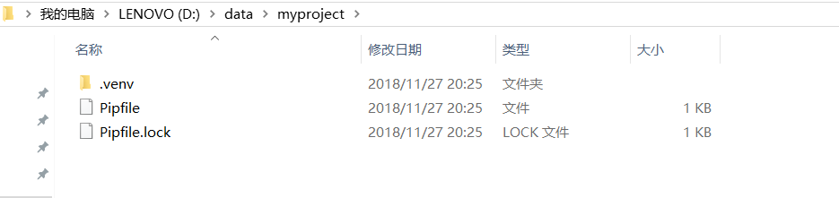
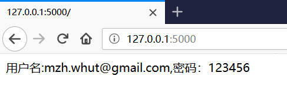

.. _pipenv:

Pipenv虚拟环境的使用
======================

.. contents:: 目录

pipenv 是Kenneth Reitz大神的作品，提供Python的各个版本间的管理，各种包管理。是virtualenv pip等工具的合体。

Pipenv的优点
--------------------

- 自动关联项目相关的 **virtualenv**，能够快速的加载 **virtualenv** 。
- 提供的pipenv替代pip并自带一个依赖清单Pipfile，和依赖锁定Pipfile.lock。
- Pipfile除了依赖清单还支持固定pypi源地址,固定python版本。
- Pipfile还支持dev依赖清单.pipenv install的包会强制使用Pipfile中的源.
- 使用pipenv graph命令可以看到依赖树。
- 可以直接切换python2,3。
- 可通过自动加载 .env 读取环境变量，简化开发流程。

Pipenv的缺点
--------------------

- windows上切入virtualenv,命令行开头无virtualenv名字。
- Pipfile中的pypi源无法默认设置，造成每次都需要手动修改。

Pipenv的安装
--------------------
本文使用Python3.6.2作为测试环境。
Python3.6.2安装文件的下载地址如下：https://www.python.org/downloads/release/python-362/

安装后会自动安装pip，请提前修改pip源地址。

使用pip安装Pipenv::

    $ pip install pipenv
    Looking in indexes: http://mirrors.aliyun.com/pypi/simple/
    Collecting pipenv
      Downloading http://mirrors.aliyun.com/pypi/packages/13/b4/3ffa55f77161cff9a5220f162670f7c5eb00df52e00939e203f601b0f579/pipenv-2018.11.26-py3-none-any.whl (5.2MB)
        100% |████████████████████████████████| 5.2MB 8.3MB/s
    Requirement already satisfied: certifi in d:\program files (x86)\python3.6.2\lib\site-packages (from pipenv) (2018.1.18)
    Requirement already satisfied: setuptools>=36.2.1 in d:\program files (x86)\python3.6.2\lib\site-packages (from pipenv) (40.6.2)
    Requirement already satisfied: virtualenv in d:\program files (x86)\python3.6.2\lib\site-packages (from pipenv) (16.0.0)
    Requirement already satisfied: virtualenv-clone>=0.2.5 in d:\program files (x86)\python3.6.2\lib\site-packages (from pipenv) (0.4.0)
    Requirement already satisfied: pip>=9.0.1 in d:\program files (x86)\python3.6.2\lib\site-packages (from pipenv) (18.1)
    Installing collected packages: pipenv
    Successfully installed pipenv-2018.11.26

Pipenv环境变量配置
--------------------

在环境变量中配置变量 **PIPENV_VENV_IN_PROJECT**，pipenv会在当前目录下创建.venv的目录，以后都会把模块装到这个.venv下::

    PIPENV_VENV_IN_PROJECT=1

设置 **PIPENV_PYPI_MIRROR**，配置pypi源地址(检查发现此种方式不起作用)::

    PIPENV_PYPI_MIRROR=https://mirrors.aliyun.com/pypi/simple
    
设置 **PIPENV_TEST_INDEX**，配置pypi源地址::
    
    PIPENV_TEST_INDEX=https://mirrors.aliyun.com/pypi/simple

如果后面发现PIPENV_TEST_INDEX未起作用，修改Pipenv源码文件python3.6.2\\Lib\\site-packages\\pipenv\\project.py的127行，将u"https://pypi.org/simple"改成u"https://mirrors.aliyun.com/pypi/simple"。

创建Pipenv虚拟环境
--------------------

切换到项目目录下，并创建虚拟环境::

    $ mkdir myproject                                                                                                        
                                                                                                                             
    D:\data                                                                                                                  
    $ cd myproject\                                                                                                          
                                                                                                                             
    D:\data\myproject                                                                                                        
    $ ls                                                                                                                     
                                                                                                                             
    D:\data\myproject                                                                                                        
    $ pipenv install                                                                                                         
    Creating a virtualenv for this project…                                                                                  
    Pipfile: D:\data\myproject\Pipfile                                                                                       
    Using d:\program files (x86)\python3.6.2\python.exe (3.6.2) to create virtualenv…                                        
    [  ==] Creating virtual environment...Already using interpreter d:\program files (x86)\python3.6.2\python.exe            
    Using base prefix 'd:\\program files (x86)\\python3.6.2'                                                                 
    New python executable in D:\data\myproject\.venv\Scripts\python.exe                                                      
    Installing setuptools, pip, wheel...done.                                                                                
                                                                                                                             
    Successfully created virtual environment!                                                                                
    Virtualenv location: D:\data\myproject\.venv                                                                             
    Creating a Pipfile for this project…                                                                                     
    Pipfile.lock not found, creating…                                                                                        
    Locking [dev-packages] dependencies…                                                                                     
    Locking [packages] dependencies…                                                                                         
    Updated Pipfile.lock (ca72e7)!                                                                                           
    Installing dependencies from Pipfile.lock (ca72e7)…                                                                      
      ================================ 0/0 - 00:00:00                                                                        
    To activate this project's virtualenv, run pipenv shell.                                                                 
    Alternatively, run a command inside the virtualenv with pipenv run.                                                      
                                                                                                                             
    D:\data\myproject                                                                                                        
    $
    
初始化虚拟环境后，会在项目目录下生成Pipfile和Pipfile.lock，以及目录.venv。如下图所示：

Pipfile和Pipfile.lock为pipenv包的配置文件，代替原来的 requirement.txt。

项目提交时，可将Pipfile 文件和Pipfile.lock文件一并提交,待其他开发克隆下载，根据此Pipfile运行命令pipenv install --dev生成自己的虚拟环境。

通过pipenv install初始化虚拟环境时，Pipenv会查找本地安装的Python版本，作为Pipenv虚拟环境的基础，并仅安装setuptools, pip, wheel三个包。

在Virtualenv中执行命令
--------------------------

通过pipenv run  *command* 可查在Virtualenv虚拟环境中执行命令，如下使用pipenv run pip list查看安装的包::

    $ pipenv run pip list
    Loading .env environment variables…
    Package    Version
    ---------- -------
    pip        18.1
    setuptools 40.6.2
    wheel      0.32.3

安装包
--------------------

使用pipenv install  *package_name* 安装Python包::

    $ pipenv install flask
    Installing flask…
    Adding flask to Pipfile's [packages]…
    Installation Succeeded
    Pipfile.lock (4a5fad) out of date, updating to (a8f5d4)…
    Locking [dev-packages] dependencies…
    Locking [packages] dependencies…
    Success!
    Updated Pipfile.lock (4a5fad)!
    Installing dependencies from Pipfile.lock (4a5fad)…
      ================================ 6/6 - 00:00:01
    To activate this project's virtualenv, run pipenv shell.
    Alternatively, run a command inside the virtualenv with pipenv run.

此时再查看安装的包的情况::

    $ pipenv run pip list                  
    Loading .env environment variables…    
    Package      Version                   
    ------------ -------                   
    Click        7.0                       
    Flask        1.0.2                     
    itsdangerous 1.1.0                     
    Jinja2       2.10                      
    MarkupSafe   1.1.0                     
    pip          18.1                      
    setuptools   40.6.2                    
    Werkzeug     0.14.1                    
    wheel        0.32.3                    
    

以上命令只能查看到安装的包的情况，但并不知道包之间的依赖关系。可以使用pipenv graph查看包的依赖关系。

查看安装的包和依赖关系
----------------------------

使用pipenv graph查看包的依赖关系::

    $ pipenv graph
    Flask==1.0.2
      - click [required: >=5.1, installed: 7.0]
      - itsdangerous [required: >=0.24, installed: 1.1.0]
      - Jinja2 [required: >=2.10, installed: 2.10]
        - MarkupSafe [required: >=0.23, installed: 1.1.0]
      - Werkzeug [required: >=0.14, installed: 0.14.1]
  
  
将包导出到requirement.txt文件
--------------------------------

使用pipenv lock -r > requirements.txt 命令依赖包导出到文件::

    $ pipenv lock -r > requirements.txt             
                                                                                  
    $ cat requirements.txt                          
    -i https://mirrors.aliyun.com/pypi/simple/      
    click==7.0                                      
    flask==1.0.2                                    
    itsdangerous==1.1.0                             
    jinja2==2.10                                    
    markupsafe==1.1.0                               
    werkzeug==0.14.1                                

通过requirements.txt安装包
--------------------------------

可以将requirements.txt给别人，别人通过requirements.txt安装包::

    $ mkdir ..\my_new_project

    $ cp requirements.txt  ..\my_new_project\

    $ cd ..\my_new_project\

    $ pipenv install -r requirements.txt                                                                                  
    Creating a virtualenv for this project…                                                                               
    Pipfile: D:\data\my_new_project\Pipfile                                                                               
    Using d:\program files (x86)\python3.6.2\python.exe (3.6.2) to create virtualenv…                                     
    [    ] Creating virtual environment...Already using interpreter d:\program files (x86)\python3.6.2\python.exe         
    Using base prefix 'd:\\program files (x86)\\python3.6.2'                                                              
    New python executable in D:\data\my_new_project\.venv\Scripts\python.exe                                              
    Installing setuptools, pip, wheel...done.                                                                             
                                                                                                                          
    Successfully created virtual environment!                                                                             
    Virtualenv location: D:\data\my_new_project\.venv                                                                     
    Creating a Pipfile for this project…                                                                                  
    Requirements file provided! Importing into Pipfile…                                                                   
    Pipfile.lock not found, creating…                                                                                     
    Locking [dev-packages] dependencies…                                                                                  
    Locking [packages] dependencies…                                                                                      
    Success!                                                                                                              
    Updated Pipfile.lock (4c2105)!                                                                                        
    Installing dependencies from Pipfile.lock (4c2105)…                                                                   
      ================================ 6/6 - 00:00:02                                                                     
    To activate this project's virtualenv, run pipenv shell.                                                              
    Alternatively, run a command inside the virtualenv with pipenv run.                                                   
                                                                                                                          
                                                                                                                          
检查新项目中的包的安装情况::

    $ pipenv run pip list
    Package      Version
    ------------ -------
    Click        7.0
    Flask        1.0.2
    itsdangerous 1.1.0
    Jinja2       2.10
    MarkupSafe   1.1.0
    pip          18.1
    setuptools   40.6.2
    Werkzeug     0.14.1
    wheel        0.32.3

可以发现与原来项目中的包是一样的。

卸载包
--------------------------------

通过pipenv uninstall  *package_name* 卸载包::

    $ pipenv uninstall flask                      
    Uninstalling flask…                           
    Uninstalling Flask-1.0.2:                     
      Successfully uninstalled Flask-1.0.2        
                                                  
    Removing flask from Pipfile…                  
    Locking [dev-packages] dependencies…          
    Locking [packages] dependencies…              
    Success!                                      
    Updated Pipfile.lock (48af14)!                

在Pipenv Shell环境下工作
--------------------------------
使用pipenv shell启动shell环境::

    $ pipenv shell
    Launching subshell in virtual environment…

删除卸载环境
--------------------------------

使用pipenv --rm 删除虚拟环境::

    $ pipenv --rm
    Removing virtualenv (D:\data\my_new_project\.venv)…
    
注意: 删除虚拟环境后，只是删除了.venv目录，但项目下面的Pipfile和Pipfile.lock并没有被删除。

指定Python路径安装虚拟环境
--------------------------------
假如我想安装Python3.7的虚拟环境，尝试去初始化::

    $ pipenv --python 3.7
    Warning: Python 3.7 was not found on your system…
    You can specify specific versions of Python with:
      $ pipenv --python path\to\python

说明我电脑系统中没有Python3.7，我可以通过指定Python的路径来初始化虚拟环境，这在linux系统中非root用户不想使用系统默认的Python环境时非常有用。

指定Python路径安装虚拟环境::

    $ pipenv --python "D:\Program Files (x86)\python3.6.2\python.exe"                                         
    Creating a virtualenv for this project…                                                                   
    Pipfile: D:\data\my_newpro\Pipfile                                                                        
    Using D:\Program Files (x86)\python3.6.2\python.exe (3.6.2) to create virtualenv…                         
    [==  ] Creating virtual environment...Using base prefix 'D:\\Program Files (x86)\\python3.6.2'            
    New python executable in D:\data\my_newpro\.venv\Scripts\python.exe                                       
    Installing setuptools, pip, wheel...done.                                                                 
    Running virtualenv with interpreter D:\Program Files (x86)\python3.6.2\python.exe                         
                                                                                                              
    Successfully created virtual environment!                                                                 
    Virtualenv location: D:\data\my_newpro\.venv                                                              
    Creating a Pipfile for this project…                                                                      
                                                                                                              

Pipenv的帮助文档
--------------------------------
使用pipenv -h可以查看Pipenv的帮助文档信息::

    $ pipenv -h
    Usage: pipenv [OPTIONS] COMMAND [ARGS]...

    Options:
      --where             Output project home information.  # 项目目录信息
      --venv              Output virtualenv information.  # 输出 virtualenv 的目录信息
      --py                Output Python interpreter information.  # 输出 Python 解析器的路径
      --envs              Output Environment Variable options.  # 输出可设置的环境变量
      --rm                Remove the virtualenv.  # 删除虚拟环境
      --bare              Minimal output.
      --completion        Output completion (to be eval'd).
      --man               Display manpage.
      --support           Output diagnostic information for use in GitHub issues.
      --site-packages     Enable site-packages for the virtualenv.  [env var:
                          PIPENV_SITE_PACKAGES]
      --python TEXT       Specify which version of Python virtualenv should use.
      --three / --two     Use Python 3/2 when creating virtualenv.
      --clear             Clears caches (pipenv, pip, and pip-tools).  [env var:
                          PIPENV_CLEAR]
      -v, --verbose       Verbose mode.
      --pypi-mirror TEXT  Specify a PyPI mirror.  # 指定PyPI源
      --version           Show the version and exit.  # 显示Pipenv的版本
      -h, --help          Show this message and exit.

    Usage Examples:
       Create a new project using Python 3.7, specifically:
       $ pipenv --python 3.7

       Remove project virtualenv (inferred from current directory):
       $ pipenv --rm

       Install all dependencies for a project (including dev):
       $ pipenv install --dev

       Create a lockfile containing pre-releases:
       $ pipenv lock --pre

       Show a graph of your installed dependencies:
       $ pipenv graph

       Check your installed dependencies for security vulnerabilities:
       $ pipenv check

       Install a local setup.py into your virtual environment/Pipfile:
       $ pipenv install -e .

       Use a lower-level pip command:
       $ pipenv run pip freeze

    Commands:
      check      Checks for security vulnerabilities and against PEP 508 markers
                 provided in Pipfile.  # 检查安全漏洞
      clean      Uninstalls all packages not specified in Pipfile.lock.
      graph      Displays currently-installed dependency graph information.  # 显示当前依赖关系图信息
      install    Installs provided packages and adds them to Pipfile, or (if no
                 packages are given), installs all packages from Pipfile.  # 安装包
      lock       Generates Pipfile.lock.  # 生成Pipfile.lock
      open       View a given module in your editor.  # 在编辑器中查看一个特定模块
      run        Spawns a command installed into the virtualenv.  # 在 virtualenv 中执行命令
      shell      Spawns a shell within the virtualenv.  # 进入到虚拟Shell环境
      sync       Installs all packages specified in Pipfile.lock.
      uninstall  Un-installs a provided package and removes it from Pipfile.  # 卸载包
      update     Runs lock, then sync.  # 卸载当前所以依赖，然后安装最新包

      
Pipenv自动加载配置文件
--------------------------------
如果在项目目录中存在.env文件，那么在pipenv shell或pipenv run中都会自动加载.env文件。这对于保存一些敏感信息非常重要。

将敏感信息保存到.env文件中，不使用硬代码写入到项目中::

    $ cat .env
    MAIL_USERNAME=mzh.whut@gmail.com
    MAIL_PASSWORD=123456
    SECRET_KEY=nobody know this
    D:\data\myproject
    $ pipenv shell
    Loading .env environment variables…
    Launching subshell in virtual environment…

    $ python                                                                                    
    Python 3.6.2 (v3.6.2:5fd33b5, Jul  8 2017, 04:57:36) [MSC v.1900 64 bit (AMD64)] on win32   
    Type "help", "copyright", "credits" or "license" for more information.                      
    >>> import os                                                                               
    >>> os.environ.get('MAIL_USERNAME')                                                         
    'mzh.whut@gmail.com'                                                                        
    >>> os.environ.get('MAIL_PASSWORD')                                                         
    '123456'                                                                                    
    >>> os.environ.get('SECRET_KEY')                                                            
    'nobody know this'                                                                          

    
在Flask中加载.env配置文件
--------------------------------

示例文件如下::

    #!/usr/bin/python3
    """
    @Author  : Zhaohui Mei(梅朝辉)
    @Email   : mzh.whut@gmail.com

    @Time    : 2018/11/27 23:32
    @File    : myweb.py
    @Version : 1.0
    @Interpreter: Python3.6.2
    @Software: PyCharm

    @Description: 测试使用.env文件加载配置
    """

    import os

    from flask import Flask

    # 创建类的实例，是一个WSGI应用程序
    app = Flask(__name__)

    @app.route('/')
    def index():
        MAIL_USERNAME = os.environ.get('MAIL_USERNAME')
        MAIL_PASSWORD = os.environ.get('MAIL_PASSWORD')

        return f'用户名:{MAIL_USERNAME},密码：{MAIL_PASSWORD}'

    if __name__ == '__main__':
        #  run()函数让应用运行在本地服务器上
        app.run(debug=True)

直接运行，在命令行显示结果如下::

    D:\data\myproject\.venv\Scripts\python.exe D:/data/myproject/myweb.py
     * Tip: There are .env files present. Do "pip install python-dotenv" to use them.
     * Serving Flask app "myweb" (lazy loading)
     * Environment: production
       WARNING: Do not use the development server in a production environment.
       Use a production WSGI server instead.
     * Debug mode: on
     * Restarting with stat
     * Tip: There are .env files present. Do "pip install python-dotenv" to use them.
     * Debugger is active!
     * Debugger PIN: 174-500-507
     * Running on http://127.0.0.1:5000/ (Press CTRL+C to quit)
    127.0.0.1 - - [27/Nov/2018 23:35:13] "GET / HTTP/1.1" 200 -

此时查看 http://127.0.0.1:5000/ ，结果如下图所示:

.. image:: ./_static/images/pipenv_none.png

可知Flask并没有获取到相应的配置数据，需要安装python-dotenv，在虚拟环境中安装::

    $ pipenv install python-dotenv
    Installing python-dotenv…
    Adding python-dotenv to Pipfile's [packages]…
    Installation Succeeded
    Pipfile.lock (d90202) out of date, updating to (4a5fad)…
    Locking [dev-packages] dependencies…
    Locking [packages] dependencies…
    Success!
    Updated Pipfile.lock (d90202)!
    Installing dependencies from Pipfile.lock (d90202)…
      ================================ 7/7 - 00:00:02
    To activate this project's virtualenv, run pipenv shell.
    Alternatively, run a command inside the virtualenv with pipenv run.

    $ pipenv run pip list
    Loading .env environment variables…
    Package       Version
    ------------- -------
    Click         7.0
    Flask         1.0.2
    itsdangerous  1.1.0
    Jinja2        2.10
    MarkupSafe    1.1.0
    pip           18.1
    python-dotenv 0.9.1
    setuptools    40.6.2
    Werkzeug      0.14.1
    wheel         0.32.3

安装完成python-dotenv后，再重新运行Flask项目，重新访问 http://127.0.0.1:5000/ ，结果如下图所示:

说明.env配置数据已经成功解析。

**注意:当将项目上传到github代码仓库时，请忽略掉.env文件，即将.env加入到.gitignore文件列表中**

参考文献：

- Python包和版本管理的最好工具----pipenv http://www.mamicode.com/info-detail-2214218.html?tdsourcetag=s_pcqq_aiomsg

- pipenv使用 https://www.jianshu.com/p/d06684101a3d?tdsourcetag=s_pcqq_aiomsg

- pipenv的高级用法 https://www.jianshu.com/p/8c6ae288ba48

- Advanced Usage of Pipenv https://pipenv.readthedocs.io/en/latest/advanced/

- PyPI中Pipenv的说明 https://pypi.org/project/pipenv/

- Pipenv源码 https://github.com/pypa/pipenv
