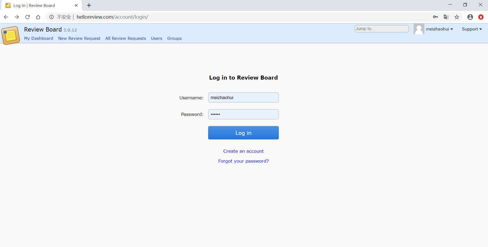
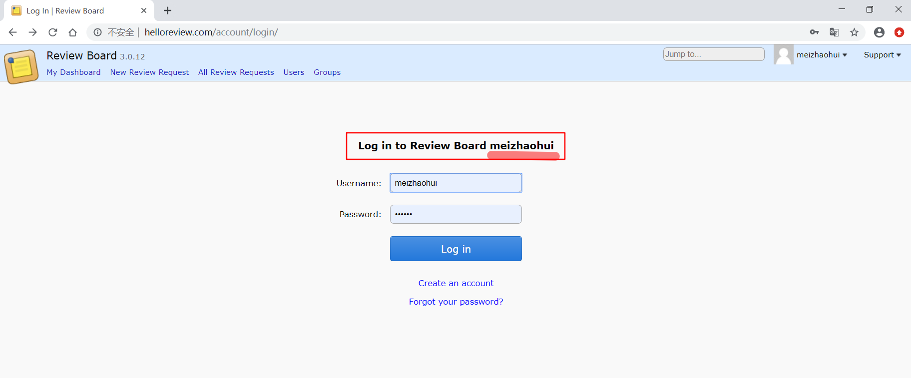
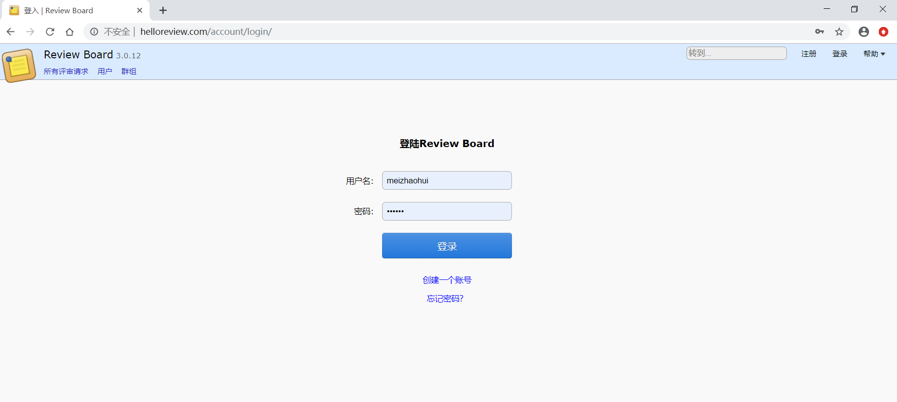

.. _reviewboard_i18n:

ReviewBoard国际化配置
======================

.. contents:: 目录

ReviewBoard是一个代码评审系统，当前默认没有配置中文翻译，本节主要讲解如何将ReviewBoard系统汉化。

基本信息
--------------------

查看Django版本::

    [root@helloreview ~]# pip list|grep Django
    DEPRECATION: Python 2.7 will reach the end of its life on January 1st, 2020. Please upgrade your Python as Python 2.7 won't be maintained after that date. A future version of pip will drop support for Python 2.7. More details about Python 2 support in pip, can be found at https://pip.pypa.io/en/latest/development/release-process/#python-2-support
    Django                             1.6.11

Django安装目录::

    [root@helloreview ~]# ls -lah /usr/lib/python2.7/site-packages/django
    total 36K
    drwxr-xr-x  17 root root  255 Aug 27 11:01 .
    drwxr-xr-x. 95 root root 8.0K Sep  5 20:23 ..
    drwxr-xr-x   3 root root  217 Aug 27 11:01 bin
    drwxr-xr-x   6 root root  168 Sep  5 22:38 conf
    drwxr-xr-x  19 root root  317 Aug 27 11:01 contrib
    drwxr-xr-x  10 root root 4.0K Aug 27 11:01 core
    drwxr-xr-x   4 root root  153 Aug 27 11:01 db
    drwxr-xr-x   2 root root  125 Aug 27 11:01 dispatch
    drwxr-xr-x   3 root root  269 Aug 27 11:01 forms
    drwxr-xr-x   2 root root  242 Aug 27 11:01 http
    -rw-r--r--   1 root root  270 Aug 27 11:00 __init__.py
    -rw-r--r--   1 root root  465 Aug 27 11:01 __init__.pyc
    drwxr-xr-x   2 root root 4.0K Sep  1 09:52 middleware
    drwxr-xr-x   2 root root   45 Aug 27 11:01 shortcuts
    drwxr-xr-x   3 root root 4.0K Aug 27 11:01 template
    drwxr-xr-x   2 root root  237 Aug 27 11:01 templatetags
    drwxr-xr-x   2 root root  331 Aug 27 11:01 test
    drwxr-xr-x   5 root root 4.0K Aug 27 11:01 utils
    drwxr-xr-x   4 root root  247 Aug 27 11:01 views

查看ReviewBoard版本::

    [root@helloreview ~]# pip list|grep -i Review 
    DEPRECATION: Python 2.7 will reach the end of its life on January 1st, 2020. Please upgrade your Python as Python 2.7 won't be maintained after that date. A future version of pip will drop support for Python 2.7. More details about Python 2 support in pip, can be found at https://pip.pypa.io/en/latest/development/release-process/#python-2-support
    ReviewBoard                        3.0.12

ReviewBoard相关目录::

    [root@helloreview ~]# ls -lah /usr/lib64/python2.7/site-packages/reviewboard
    total 240K
    drwxr-xr-x  29 root   root   4.0K Sep  6 13:00 .
    drwxr-xr-x. 33 root   root   4.0K Sep  6 14:00 ..
    drwxr-xr-x   8 root   root   4.0K Sep  2 19:58 accounts
    drwxr-xr-x   5 root   root   4.0K Sep  5 23:37 admin
    drwxr-xr-x   5 root   root   4.0K Aug 27 11:01 attachments
    drwxr-xr-x   3 root   root    254 Sep  5 23:41 avatars
    drwxr-xr-x   3 root   root    164 Aug 27 11:01 changedescs
    drwxr-xr-x   3 root   root    158 Aug 27 11:01 cmdline
    drwxr-xr-x   2 root   root    298 Sep  2 19:59 datagrids
    -rw-r--r--   1 root   root   5.2K Aug 27 10:59 dependencies.py
    -rw-r--r--   1 root   root   5.3K Aug 27 11:01 dependencies.pyc
    -rw-r--r--   1 root   root   1.2K Aug 27 10:59 deprecation.py
    -rw-r--r--   1 root   root   1.6K Aug 27 11:01 deprecation.pyc
    drwxr-xr-x   7 root   root   4.0K Sep  4 21:24 diffviewer
    drwxr-xr-x   6 root   root    281 Aug 27 11:01 extensions
    drwxr-xr-x   2 root   root    117 Aug 27 11:01 features
    drwxr-xr-x   7 root   root   4.0K Aug 27 11:01 hostingsvcs
    drwxr-xr-x   4 root   root     33 Aug 27 11:01 htdocs
    -rw-r--r--   1 root   root   5.0K Aug 27 10:59 __init__.py
    -rw-r--r--   1 root   root   4.4K Aug 27 11:01 __init__.pyc
    drwxr-xr-x   3 root   root    254 Aug 27 11:01 integrations
    drwxr-xr-x   9 root   root     91 Sep  1 10:17 locale
    -rw-r--r--   1 root   root    12K Aug 27 10:59 manage.py
    -rw-r--r--   1 root   root   8.5K Aug 27 11:01 manage.pyc
    -rw-r--r--   1 root   root    179 Aug 27 10:59 nose.cfg
    drwxr-xr-x   6 root   root    288 Aug 27 11:01 notifications
    drwxr-xr-x   3 root   root   4.0K Aug 27 11:01 oauth
    -rw-r--r--   1 root   root    949 Aug 27 10:59 rb_platform.py
    -rw-r--r--   1 root   root    635 Aug 27 11:01 rb_platform.pyc
    drwxr-xr-x   2 root   root    117 Aug 27 11:01 registries
    drwxr-xr-x   2 apache apache   29 Aug 30 21:52 reviewboardlog
    drwxr-xr-x   8 root   root   4.0K Sep  5 22:35 reviews
    drwxr-xr-x   9 root   root   4.0K Aug 27 11:01 scmtools
    drwxr-xr-x   3 root   root   4.0K Aug 27 11:01 search
    -rw-r--r--   1 root   root    17K Sep  5 22:09 settings.py
    -rw-r--r--   1 root   root   2.0K Aug 27 10:59 signals.py
    -rw-r--r--   1 root   root   1.8K Aug 27 11:01 signals.pyc
    drwxr-xr-x   5 root   root   4.0K Aug 30 22:33 site
    drwxr-xr-x   2 root   root    253 Aug 27 11:01 ssh
    drwxr-xr-x   4 root   root     27 Aug 27 11:01 static
    -rw-r--r--   1 root   root    23K Aug 27 10:59 staticbundles.py
    -rw-r--r--   1 root   root    34K Aug 27 11:01 staticbundles.pyc
    drwxr-xr-x  17 root   root    326 Aug 27 11:01 templates
    drwxr-xr-x   2 root   root    176 Aug 27 11:01 testing
    -rw-r--r--   1 root   root   1.7K Aug 27 10:59 test.py
    -rw-r--r--   1 root   root   2.3K Aug 27 11:01 test.pyc
    -rw-r--r--   1 root   root   1.7K Aug 27 10:59 tests.py
    -rw-r--r--   1 root   root   2.3K Aug 27 11:01 tests.pyc
    -rw-r--r--   1 root   root   3.9K Aug 27 10:59 urls.py
    -rw-r--r--   1 root   root   3.5K Aug 27 11:01 urls.pyc
    drwxr-xr-x   5 root   root   4.0K Sep  4 23:27 webapi

ReviewBoard静态文件目录::

    [root@helloreview ~]# ls -lah /var/www/html/reviewboard/
    total 0
    drwxr-xr-x  7 apache apache 67 Sep  1 20:28 .
    drwxr-xr-x. 3 root   root   34 Sep  6 13:15 ..
    drwxr-xr-x  2 apache apache 98 Sep  5 21:45 conf
    drwxr-xr-x  3 apache apache 25 Aug 27 11:52 data
    drwxr-xr-x  5 apache apache 74 Aug 31 19:52 htdocs
    drwxr-xr-x  2 apache apache  6 Aug 27 11:28 logs
    drwxrwxrwx  2 apache apache  6 Aug 27 11:28 tmp

配置文件
--------------------

- Django默认配置文件： ``/usr/lib/python2.7/site-packages/django/conf/global_settings.py``
- ReviewBoard的Django项目配置文件： ``/usr/lib64/python2.7/site-packages/reviewboard/settings.py``
- ReviewBoard网站配置文件： ``/var/www/html/reviewboard/conf/settings_local.py``

Django关于语言和时区的配置::

    [root@hellolinux ~]# cat -n /usr/lib/python2.7/site-packages/django/conf/global_settings.py|sed -n '36,144p'
        36  # Local time zone for this installation. All choices can be found here:
        37  # http://en.wikipedia.org/wiki/List_of_tz_zones_by_name (although not all
        38  # systems may support all possibilities). When USE_TZ is True, this is
        39  # interpreted as the default user time zone.
        40  TIME_ZONE = 'America/Chicago'
        41
        42  # If you set this to True, Django will use timezone-aware datetimes.
        43  USE_TZ = False
        44
        45  # Language code for this installation. All choices can be found here:
        46  # http://www.i18nguy.com/unicode/language-identifiers.html
        47  LANGUAGE_CODE = 'en-us'
        48
        49  # Languages we provide translations for, out of the box.
        50  LANGUAGES = (
        51      ('af', gettext_noop('Afrikaans')),
        52      ('ar', gettext_noop('Arabic')),
        53      ('az', gettext_noop('Azerbaijani')),
        54      ('bg', gettext_noop('Bulgarian')),
        55      ('be', gettext_noop('Belarusian')),
        56      ('bn', gettext_noop('Bengali')),
        57      ('br', gettext_noop('Breton')),
        58      ('bs', gettext_noop('Bosnian')),
        59      ('ca', gettext_noop('Catalan')),
        60      ('cs', gettext_noop('Czech')),
        61      ('cy', gettext_noop('Welsh')),
        62      ('da', gettext_noop('Danish')),
        63      ('de', gettext_noop('German')),
        64      ('el', gettext_noop('Greek')),
        65      ('en', gettext_noop('English')),
        66      ('en-gb', gettext_noop('British English')),
        67      ('eo', gettext_noop('Esperanto')),
        68      ('es', gettext_noop('Spanish')),
        69      ('es-ar', gettext_noop('Argentinian Spanish')),
        70      ('es-mx', gettext_noop('Mexican Spanish')),
        71      ('es-ni', gettext_noop('Nicaraguan Spanish')),
        72      ('es-ve', gettext_noop('Venezuelan Spanish')),
        73      ('et', gettext_noop('Estonian')),
        74      ('eu', gettext_noop('Basque')),
        75      ('fa', gettext_noop('Persian')),
        76      ('fi', gettext_noop('Finnish')),
        77      ('fr', gettext_noop('French')),
        78      ('fy-nl', gettext_noop('Frisian')),
        79      ('ga', gettext_noop('Irish')),
        80      ('gl', gettext_noop('Galician')),
        81      ('he', gettext_noop('Hebrew')),
        82      ('hi', gettext_noop('Hindi')),
        83      ('hr', gettext_noop('Croatian')),
        84      ('hu', gettext_noop('Hungarian')),
        85      ('ia', gettext_noop('Interlingua')),
        86      ('id', gettext_noop('Indonesian')),
        87      ('is', gettext_noop('Icelandic')),
        88      ('it', gettext_noop('Italian')),
        89      ('ja', gettext_noop('Japanese')),
        90      ('ka', gettext_noop('Georgian')),
        91      ('kk', gettext_noop('Kazakh')),
        92      ('km', gettext_noop('Khmer')),
        93      ('kn', gettext_noop('Kannada')),
        94      ('ko', gettext_noop('Korean')),
        95      ('lb', gettext_noop('Luxembourgish')),
        96      ('lt', gettext_noop('Lithuanian')),
        97      ('lv', gettext_noop('Latvian')),
        98      ('mk', gettext_noop('Macedonian')),
        99      ('ml', gettext_noop('Malayalam')),
       100      ('mn', gettext_noop('Mongolian')),
       101      ('my', gettext_noop('Burmese')),
       102      ('nb', gettext_noop('Norwegian Bokmal')),
       103      ('ne', gettext_noop('Nepali')),
       104      ('nl', gettext_noop('Dutch')),
       105      ('nn', gettext_noop('Norwegian Nynorsk')),
       106      ('os', gettext_noop('Ossetic')),
       107      ('pa', gettext_noop('Punjabi')),
       108      ('pl', gettext_noop('Polish')),
       109      ('pt', gettext_noop('Portuguese')),
       110      ('pt-br', gettext_noop('Brazilian Portuguese')),
       111      ('ro', gettext_noop('Romanian')),
       112      ('ru', gettext_noop('Russian')),
       113      ('sk', gettext_noop('Slovak')),
       114      ('sl', gettext_noop('Slovenian')),
       115      ('sq', gettext_noop('Albanian')),
       116      ('sr', gettext_noop('Serbian')),
       117      ('sr-latn', gettext_noop('Serbian Latin')),
       118      ('sv', gettext_noop('Swedish')),
       119      ('sw', gettext_noop('Swahili')),
       120      ('ta', gettext_noop('Tamil')),
       121      ('te', gettext_noop('Telugu')),
       122      ('th', gettext_noop('Thai')),
       123      ('tr', gettext_noop('Turkish')),
       124      ('tt', gettext_noop('Tatar')),
       125      ('udm', gettext_noop('Udmurt')),
       126      ('uk', gettext_noop('Ukrainian')),
       127      ('ur', gettext_noop('Urdu')),
       128      ('vi', gettext_noop('Vietnamese')),
       129      ('zh-cn', gettext_noop('Simplified Chinese')),
       130      ('zh-tw', gettext_noop('Traditional Chinese')),
       131  )
       132
       133  # Languages using BiDi (right-to-left) layout
       134  LANGUAGES_BIDI = ("he", "ar", "fa", "ur")
       135
       136  # If you set this to False, Django will make some optimizations so as not
       137  # to load the internationalization machinery.
       138  USE_I18N = True
       139  LOCALE_PATHS = ()
       140  LANGUAGE_COOKIE_NAME = 'django_language'
       141
       142  # If you set this to True, Django will format dates, numbers and calendars
       143  # according to user current locale.
       144  USE_L10N = False

ReviewBoard关于语言和时区的配置::

    [root@hellolinux ~]# cat -n /usr/lib64/python2.7/site-packages/reviewboard/settings.py|sed -n '29,70p'
        29  # Time zone support. If enabled, Django stores date and time information as
        30  # UTC in the database, uses time zone-aware datetime objects, and translates
        31  # them to the user's time zone in templates and forms.
        32  USE_TZ = True
        33
        34  # Local time zone for this installation. All choices can be found here:
        35  # http://www.postgresql.org/docs/8.1/static/datetime-keywords.html#DATETIME-TIMEZONE-SET-TABLE
        36  # When USE_TZ is enabled, this is used as the default time zone for datetime
        37  # objects
        38  TIME_ZONE = 'UTC'
        39
        40  # Language code for this installation. All choices can be found here:
        41  # http://www.w3.org/TR/REC-html40/struct/dirlang.html#langcodes
        42  # http://blogs.law.harvard.edu/tech/stories/storyReader$15
        43  LANGUAGE_CODE = 'en-us'
        44
        45  # This should match the ID of the Site object in the database.  This is used to
        46  # figure out URLs to stick in e-mails and related pages.
        47  SITE_ID = 1
        48
        49  # The prefix for e-mail subjects sent to administrators.
        50  EMAIL_SUBJECT_PREFIX = "[Review Board] "
        51
        52  # Whether to allow for smart spoofing of From addresses for e-mails.
        53  #
        54  # If enabled (default), DMARC records will be looked up before determining
        55  # whether to use the user's e-mail address as the From address.
        56  #
        57  # If disabled, the old, dumb approach of assuming we can spoof will be used.
        58  EMAIL_ENABLE_SMART_SPOOFING = True
        59
        60  # Default name of the service used in From e-mail when not spoofing.
        61  #
        62  # This should generally not be overridden unless one needs to thoroughly
        63  # distinguish between two different Review Board servers AND DMARC is causing
        64  # issues for e-mails.
        65  EMAIL_DEFAULT_SENDER_SERVICE_NAME = 'Review Board'
        66
        67  # If you set this to False, Django will make some optimizations so as not
        68  # to load the internationalization machinery.
        69  USE_I18N = True
        70

此时ReviewBoard登陆界面如下：

修改配置
--------------------

修改Django配置::

    TIME_ZONE = 'Asia/Shanghai'  # 设置时区为"亚洲/上海"
    USE_TZ = True  # 使用时区

修改ReviewBoard配置::

    [root@helloreview reviewboard]# cat -n /usr/lib64/python2.7/site-packages/reviewboard/settings.py|sed -n '29,80p'
        29  # Time zone support. If enabled, Django stores date and time information as
        30  # UTC in the database, uses time zone-aware datetime objects, and translates
        31  # them to the user's time zone in templates and forms.
        32  USE_TZ = True
        33
        34  # Local time zone for this installation. All choices can be found here:
        35  # http://www.postgresql.org/docs/8.1/static/datetime-keywords.html#DATETIME-TIMEZONE-SET-TABLE
        36  # When USE_TZ is enabled, this is used as the default time zone for datetime
        37  # objects
        38  TIME_ZONE = 'Asia/Shanghai'              #<-------------- 此行被修改
        39
        40  # Language code for this installation. All choices can be found here:
        41  # http://www.w3.org/TR/REC-html40/struct/dirlang.html#langcodes
        42  # http://blogs.law.harvard.edu/tech/stories/storyReader$15
        43  LANGUAGE_CODE = 'zh-CN' # en-us,zh-TW,zh-CN              #<-------------- 此行被修改
        44
        45  gettext_noop = lambda s: s               #<-------------- 此行被增加
        46  LANGUAGES = (               #<-------------- 此行被增加
        47      ('zh-cn', gettext_noop('Simplified Chinese')),               #<-------------- 此行被增加
        48      #('zh-tw', gettext_noop('Traditional Chinese')),               #<-------------- 此行被增加
        49  )               #<-------------- 此行被增加
        50
        51  # This should match the ID of the Site object in the database.  This is used to
        52  # figure out URLs to stick in e-mails and related pages.
        53  SITE_ID = 1
        54
        55  # The prefix for e-mail subjects sent to administrators.
        56  EMAIL_SUBJECT_PREFIX = "[Review Board] "
        57
        58  # Whether to allow for smart spoofing of From addresses for e-mails.
        59  #
        60  # If enabled (default), DMARC records will be looked up before determining
        61  # whether to use the user's e-mail address as the From address.
        62  #
        63  # If disabled, the old, dumb approach of assuming we can spoof will be used.
        64  EMAIL_ENABLE_SMART_SPOOFING = True
        65
        66  # Default name of the service used in From e-mail when not spoofing.
        67  #
        68  # This should generally not be overridden unless one needs to thoroughly
        69  # distinguish between two different Review Board servers AND DMARC is causing
        70  # issues for e-mails.
        71  EMAIL_DEFAULT_SENDER_SERVICE_NAME = 'Review Board'
        72
        73  # If you set this to False, Django will make some optimizations so as not
        74  # to load the internationalization machinery.
        75  USE_I18N = True
        76  BASE_DIR = os.path.dirname(os.path.dirname(__file__))               #<-------------- 此行被增加
        77  LOCALE_PATHS = (               #<-------------- 此行被增加
        78      os.path.join(BASE_DIR, 'locale')                       #<-------------- 此行被增加
        79  )               #<-------------- 此行被增加
        80

解释：

- ``TIME_ZONE = 'Asia/Shanghai'`` 设置时区为"亚洲/上海"。
- ``LANGUAGE_CODE = 'zh-CN' # en-us,zh-TW,zh-CN`` 设置语言编码，使用中文简体编码。
- ``gettext_noop = lambda s: s`` 增加国际化函数。
- ``LANGUAGES = (('zh-cn', gettext_noop('Simplified Chinese')))`` 增加国际化中文简体支持。
- ``LANGUAGES = (('zh-tw', gettext_noop('Traditional Chinese')))`` 增加国际化中文繁体支持，此行被注释。
- ``LOCALE_PATHS = (os.path.join(BASE_DIR, 'locale'))`` 指定本定国际化翻译文件所在的目录。

复制翻译文件夹
--------------------

复制已经存在的本地化配置文件夹zh_TW为zh_CN::

    [root@helloreview ~]# cd /usr/lib64/python2.7/site-packages/reviewboard/locale
    [root@helloreview locale]# cp -r zh_TW zh_CN
    [root@helloreview locale]# ls -lah
    total 4.0K
    drwxr-xr-x 10 root root  106 Sep  8 11:03 .
    drwxr-xr-x 29 root root 4.0K Sep  8 11:02 ..
    drwxr-xr-x  3 root root   25 Aug 27 11:01 en
    drwxr-xr-x  3 root root   25 Aug 27 11:01 es
    drwxr-xr-x  3 root root   25 Aug 27 11:01 it_IT
    drwxr-xr-x  3 root root   25 Aug 27 11:01 ko_KR
    drwxr-xr-x  3 root root   25 Aug 27 11:01 pt_BR
    drwxr-xr-x  3 root root   25 Sep  1 10:17 zh_CN
    drwxr-xr-x  3 root root   25 Aug 27 11:01 zh_TW
    
    [root@helloreview locale]# cd zh_CN/LC_MESSAGES
    [root@helloreview LC_MESSAGES]# ls -lah
    total 220K
    drwxr-xr-x 2 root root   78 Sep  6 13:14 .
    drwxr-xr-x 3 root root   25 Sep  1 10:17 ..
    -rw-r--r-- 1 root root  13K Sep  8 10:39 djangojs.mo
    -rw-r--r-- 1 root root  29K Sep  6 13:14 djangojs.po
    -rw-r--r-- 1 root root  48K Sep  8 10:39 django.mo
    -rw-r--r-- 1 root root 121K Sep  6 11:13 django.po

django.po和djangojs.po为汉化翻译文件，我们将ReviewBoard界面中的英文字符翻译成中文，翻译内容就在这两个文件中。

文件内容类似以下内容：

    [root@helloreview LC_MESSAGES]# tail -11 django.po 
    #: templates/datagrids/hideable_listview.html:9
    msgid "Show archived"
    msgstr "显示归档的评审请求"
    
    #: templates/datagrids/columns.py:716 templates/datagrids/columns.py:717
    msgid "Ship It!/Issue Counts"
    msgstr "评审通过/问题数量"
    
    #: reviews/default_actions:200
    msgid "Add General Comment"
    msgstr "新增普通评论"

设置重命名
--------------------

可以将以下几个常用命令加入到bashrc中::

    [root@helloreview ~]# echo "alias cdd='cd /usr/lib/python2.7/site-packages/django'" >> ~/.bashrc
    [root@helloreview ~]# echo "alias cdr='cd /usr/lib64/python2.7/site-packages/reviewboard'" >> ~/.bashrc
    [root@helloreview ~]# echo "alias cdrr='cd /var/www/html/reviewboard'" >> ~/.bashrc
    [root@helloreview ~]# echo "alias rcc='pushd /usr/lib64/python2.7/site-packages/reviewboard && django-admin.py compilemessages && popd'" >> ~/.bashrc
    [root@helloreview ~]# echo "alias rhttpd='systemctl restart httpd'" >> ~/.bashrc

重新加载个人配置::

    [root@helloreview ~]# source ~/.bashrc

查找需要翻译的英文对应的文件
-------------------------------

切换到ReviewBoard的app目录::

    [root@helloreview ~]# cdr
    [root@helloreview reviewboard]# pwd
    /usr/lib64/python2.7/site-packages/reviewboard

查找需要翻译的英文对应的文件::

    [root@helloreview reviewboard]# grep -Rn 'Log in to Review Board' *  > ../a
    [root@helloreview reviewboard]# vi ../a
    1 Binary file locale/en/LC_MESSAGES/django.mo matches 
    2 locale/en/LC_MESSAGES/django.po:3098:msgid "Log in to Review Board"
    3 Binary file locale/es/LC_MESSAGES/django.mo matches
    4 locale/es/LC_MESSAGES/django.po:3108:msgid "Log in to Review Board"
    5 Binary file locale/it_IT/LC_MESSAGES/django.mo matches
    6 locale/it_IT/LC_MESSAGES/django.po:3113:msgid "Log in to Review Board"
    7 locale/ko_KR/LC_MESSAGES/django.po:3098:msgid "Log in to Review Board"
    8 locale/pt_BR/LC_MESSAGES/django.po:3114:msgid "Log in to Review Board"
    9 Binary file locale/zh_TW/LC_MESSAGES/django.mo matches
    10 locale/zh_TW/LC_MESSAGES/django.po:3138:msgid "Log in to Review Board"
    11 Binary file locale/zh_CN/LC_MESSAGES/django.mo matches
    12 locale/zh_CN/LC_MESSAGES/django.po:3211:msgid "Log in to Review Board"
    13 templates/accounts/login.html:10: <h1></h1>

就可以知道"Log in to Review Board"这段英文对应的文件是templates/accounts/login.html的10行的内容，我们看一下这个文件：

查看待翻译的原文件内容::

    [root@helloreview reviewboard]# cat -n templates/accounts/login.html|sed -n '6,12p'
         6  
         7  
         8
         9  

        10   <h1></h1>
        11  
        12   
{{auth_backends.0.login_instructions}}

修改需要翻译的英文对应的文件
-------------------------------

我们修改一下此处的内容，看看界面上面是否有变化，如将"Log in to Review Board"修改为"Log in to Review Board meizhaohui"。

修改待翻译的原文件，并重启Apache::

    [root@helloreview reviewboard]# cat -n templates/accounts/login.html|sed -n '6,12p'
         6  
         7  
         8
         9  

        10   <h1></h1>
        11  
        12   
{{auth_backends.0.login_instructions}}

    [root@helloreview reviewboard]# rhttpd

此时再刷新一下页面看一下，是否有变化。

刷新页面后，可以看到页面中出现了"Log in to Review Board meizhaohui"，说明此处就是登陆页面对应的翻译原文件。

我们将templates/accounts/login.html文件还原成原始状态。即将第10行还原成<h1></h1>。

查看还原后的待翻译的原文件内容::

    [root@helloreview reviewboard]# cat -n templates/accounts/login.html|sed -n '6,12p'
         6  
         7  
         8
         9  

        10   <h1></h1>
        11  
        12   
{{auth_backends.0.login_instructions}}

增加翻译文本
---------------------------------

我们在翻译文件中增加翻译内容::

    [root@helloreview reviewboard]# cat -n locale/zh_CN/LC_MESSAGES/django.po|sed -n '3206,3216p'
      3206  #: templates/accounts/login.html:4
      3207  msgid "Log In"
      3208  msgstr "登入"
      3209
      3210  #: templates/accounts/login.html:10
      3211  msgid "Log in to Review Board"
      3212  msgstr "登陆Review Board"
      3213
      3214  #: templates/accounts/login.html:40 templates/base/headerbar.html:32
      3215  msgid "Log in"
      3216  msgstr "登入"

编译生成mo文件
----------------------------

编译生成mo文件::

    [root@helloreview reviewboard]# django-admin.py compilemessages
    processing file djangojs.po in /usr/lib64/python2.7/site-packages/reviewboard/locale/en/LC_MESSAGES
    processing file django.po in /usr/lib64/python2.7/site-packages/reviewboard/locale/en/LC_MESSAGES
    processing file djangojs.po in /usr/lib64/python2.7/site-packages/reviewboard/locale/es/LC_MESSAGES
    processing file django.po in /usr/lib64/python2.7/site-packages/reviewboard/locale/es/LC_MESSAGES
    processing file django.po in /usr/lib64/python2.7/site-packages/reviewboard/locale/it_IT/LC_MESSAGES
    processing file djangojs.po in /usr/lib64/python2.7/site-packages/reviewboard/locale/it_IT/LC_MESSAGES
    processing file django.po in /usr/lib64/python2.7/site-packages/reviewboard/locale/ko_KR/LC_MESSAGES
    processing file djangojs.po in /usr/lib64/python2.7/site-packages/reviewboard/locale/ko_KR/LC_MESSAGES
    processing file django.po in /usr/lib64/python2.7/site-packages/reviewboard/locale/pt_BR/LC_MESSAGES
    processing file djangojs.po in /usr/lib64/python2.7/site-packages/reviewboard/locale/pt_BR/LC_MESSAGES
    processing file djangojs.po in /usr/lib64/python2.7/site-packages/reviewboard/locale/zh_TW/LC_MESSAGES
    processing file django.po in /usr/lib64/python2.7/site-packages/reviewboard/locale/zh_TW/LC_MESSAGES
    processing file djangojs.po in /usr/lib64/python2.7/site-packages/reviewboard/locale/zh_CN/LC_MESSAGES
    processing file django.po in /usr/lib64/python2.7/site-packages/reviewboard/locale/zh_CN/LC_MESSAGES

利用快捷命令重新生成mo文件并重启Apache::

    [root@helloreview reviewboard]# rcc && rhttpd
    /usr/lib64/python2.7/site-packages/reviewboard /usr/lib64/python2.7/site-packages/reviewboard
    processing file djangojs.po in /usr/lib64/python2.7/site-packages/reviewboard/locale/en/LC_MESSAGES
    processing file django.po in /usr/lib64/python2.7/site-packages/reviewboard/locale/en/LC_MESSAGES
    processing file djangojs.po in /usr/lib64/python2.7/site-packages/reviewboard/locale/es/LC_MESSAGES
    processing file django.po in /usr/lib64/python2.7/site-packages/reviewboard/locale/es/LC_MESSAGES
    processing file django.po in /usr/lib64/python2.7/site-packages/reviewboard/locale/it_IT/LC_MESSAGES
    processing file djangojs.po in /usr/lib64/python2.7/site-packages/reviewboard/locale/it_IT/LC_MESSAGES
    processing file django.po in /usr/lib64/python2.7/site-packages/reviewboard/locale/ko_KR/LC_MESSAGES
    processing file djangojs.po in /usr/lib64/python2.7/site-packages/reviewboard/locale/ko_KR/LC_MESSAGES
    processing file django.po in /usr/lib64/python2.7/site-packages/reviewboard/locale/pt_BR/LC_MESSAGES
    processing file djangojs.po in /usr/lib64/python2.7/site-packages/reviewboard/locale/pt_BR/LC_MESSAGES
    processing file djangojs.po in /usr/lib64/python2.7/site-packages/reviewboard/locale/zh_TW/LC_MESSAGES
    processing file django.po in /usr/lib64/python2.7/site-packages/reviewboard/locale/zh_TW/LC_MESSAGES
    processing file djangojs.po in /usr/lib64/python2.7/site-packages/reviewboard/locale/zh_CN/LC_MESSAGES
    processing file django.po in /usr/lib64/python2.7/site-packages/reviewboard/locale/zh_CN/LC_MESSAGES
    /usr/lib64/python2.7/site-packages/reviewboard

重新刷新ReviewBoard系统，可以看到中文翻译:

汉化注意事项
-----------------------

- ReviewBoard 3.0.12版本对应的python版本是python2.7，不要使用python3安装ReviewBoard。
- 使用grep查找需要翻译的英文对应的字符所在原文件时，请使用重定向将结果导入到reviewboard app的上级目录文件中，避免文件内容太多，导致刷屏。

参考文献：

- `language-identifiers <http://www.i18nguy.com/unicode/language-identifiers.html>`_

